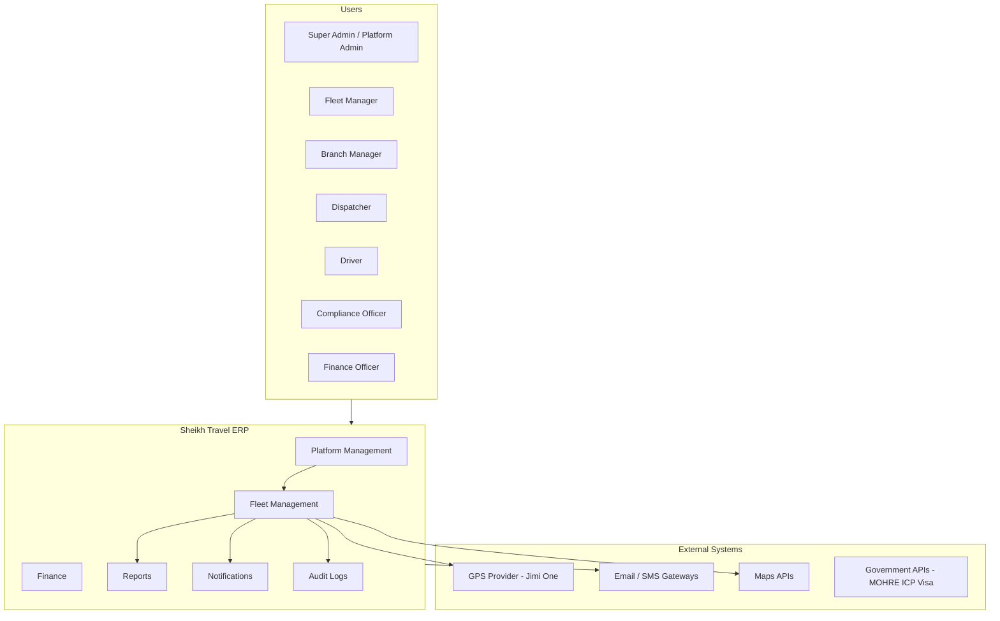
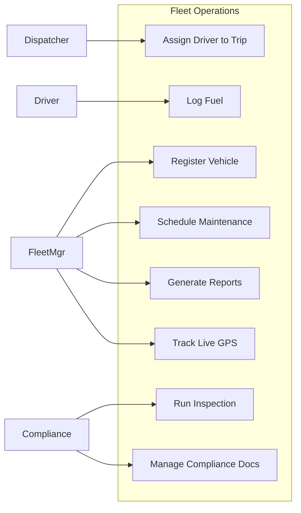
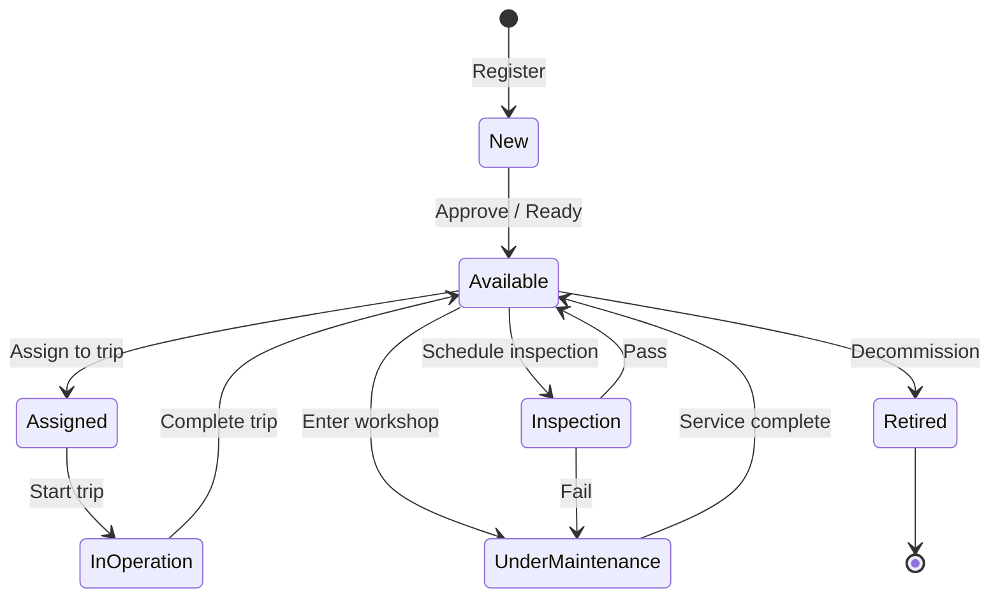
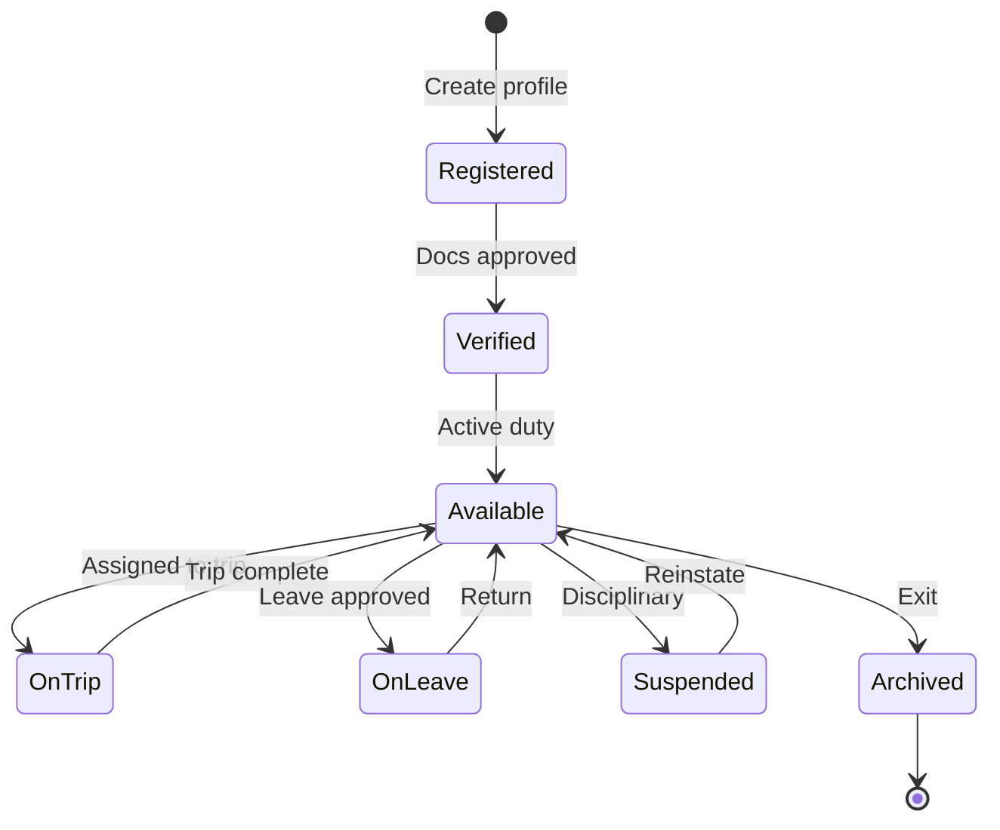
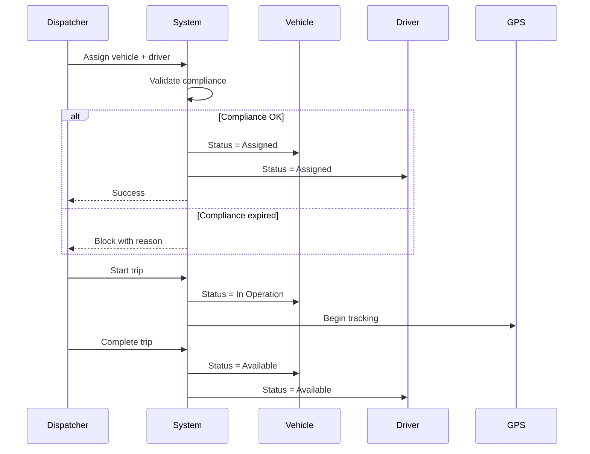
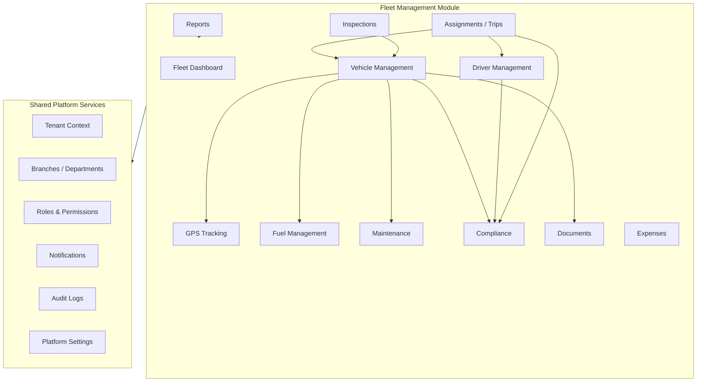
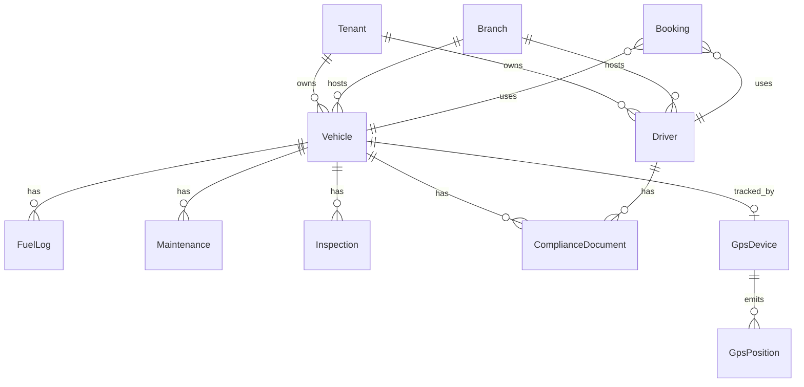
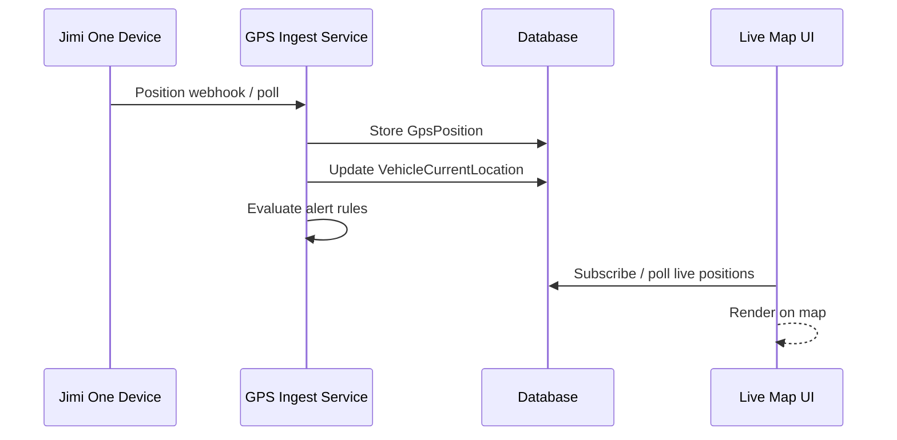

# Sheikh Travel ERP — Fleet Management System

## Phase 2: System Analysis

| Field | Value |
|-------|-------|
| **Product** | Sheikh Travel ERP — Fleet Management |
| **Document** | Phase 2 — System Analysis |
| **Version** | 1.0 |
| **Date** | June 2026 |
| **Input** | Phase 1 — Requirement Gathering |
| **Status** | Draft for review |

---

## Table of Contents

1. [Purpose](#1-purpose)
2. [System Context](#2-system-context)
3. [Stakeholders & Actors](#3-stakeholders--actors)
4. [Scope](#4-scope)
5. [Functional Requirements Summary](#5-functional-requirements-summary)
6. [Use Cases](#6-use-cases)
7. [Lifecycle Analysis](#7-lifecycle-analysis)
8. [Module Design](#8-module-design)
9. [Data Model Overview](#9-data-model-overview)
10. [Integration Points](#10-integration-points)
11. [Business Rules](#11-business-rules)
12. [Reporting & Analytics](#12-reporting--analytics)
13. [Security & Access Control](#13-security--access-control)
14. [Non-Functional Requirements](#14-non-functional-requirements)
15. [Current System Baseline](#15-current-system-baseline)
16. [Gap Analysis](#16-gap-analysis)
17. [Assumptions & Constraints](#17-assumptions--constraints)
18. [Risks](#18-risks)
19. [Phase 2 Deliverables](#19-phase-2-deliverables)
20. [Next Phase](#20-next-phase)

---

## 1. Purpose

This document translates **Phase 1 business requirements** into a structured **system analysis** for the Sheikh Travel ERP Fleet Management module.

Phase 1 answered: *What does the business need?*

Phase 2 answers:

- Who uses the system and what they do
- What the system must support functionally
- How major domains interact (vehicles, drivers, GPS, maintenance, compliance)
- What exists today vs. what must be built
- What constraints, rules, and integrations apply

This analysis is the foundation for **Phase 3 (System Design)** and implementation planning.

---

## 2. System Context

Sheikh Travel ERP is a **multi-tenant, multi-branch** enterprise platform. Fleet Management is one operational domain within the wider ERP — not a standalone product.

### 2.1 Core Principles

| Principle | Description |
|-----------|-------------|
| **Multi-tenant** | Each tenant operates in isolation; data scoped by `TenantId` |
| **Multi-branch** | Fleet assets and operations may be scoped to branches and departments |
| **Centralized operations** | One control center for vehicles, drivers, trips, and compliance |
| **Lifecycle-driven** | Vehicles and drivers follow defined status transitions |
| **Compliance-first** | Expired mandatory documents block assignment where required |
| **Real-time visibility** | GPS and operational status available to authorized roles |

---

## 3. Stakeholders & Actors

### 3.1 Stakeholders

| Stakeholder | Interest |
|-------------|----------|
| **Fleet Operations** | Utilization, assignments, dispatch efficiency |
| **Maintenance / Workshop** | Service schedules, repair history, costs |
| **Compliance / Legal** | Valid insurance, permits, licenses |
| **Finance** | Fuel, maintenance, and fleet expense visibility |
| **Management** | KPIs, utilization, cost trends |
| **IT / Platform** | Tenant onboarding, modules, security, integrations |

### 3.2 System Actors (Phase 1 Roles)

| Actor | Primary Responsibilities |
|-------|------------------------|
| **Super Admin** | Full platform access across tenants |
| **Platform Admin** | Tenant provisioning, modules, platform settings |
| **Fleet Manager** | Fleet-wide vehicles, drivers, assignments, reports |
| **Branch Manager** | Branch-scoped fleet operations |
| **Dispatcher** | Assign vehicles and drivers to trips |
| **Driver** | View assigned vehicle/trip, log fuel, update trip status |
| **Maintenance Officer** | Maintenance records, workshops, due services |
| **Compliance Officer** | Documents, expiry tracking, compliance reports |
| **Finance Officer** | Cost reports (fuel, maintenance, expenses) |
| **Report Viewer** | Read-only access to operational and management reports |

---

## 4. Scope

### 4.1 In Scope (Phase 1)

| Module | Included |
|--------|----------|
| Fleet Dashboard | Yes |
| Vehicle Management | Yes |
| Driver Management | Yes |
| GPS Tracking | Yes |
| Vehicle Assignment | Yes |
| Maintenance | Yes |
| Fuel Management | Yes |
| Inspections | Yes |
| Compliance | Yes |
| Documents | Yes |
| Expenses | Yes |
| Alerts & Notifications | Yes |
| Reports & Export | Yes |
| Audit Logs | Yes |
| Role-Based Security | Yes |

### 4.2 Out of Scope (Phase 1)

| Item | Phase |
|------|-------|
| AI prediction | Future |
| IoT sensors (beyond GPS) | Future |
| Native mobile app (full product) | Future* |
| Vehicle marketplace | Future |
| External vendor portal | Future |

\* A driver MVP app may exist in the repository; Phase 1 treats mobile as out of scope for full delivery.

### 4.3 Boundaries

Fleet Management **does not** own:

- Customer CRM (bookings reference customers; CRM is separate)
- Full accounting / GL (finance views costs; accounting is separate)
- HR payroll (driver allowance rules are adjacent, not core HR)
- Platform tenant billing (platform admin domain)

Fleet Management **does** own:

- Vehicle and driver master data
- Operational assignment and trip execution
- GPS, fuel, maintenance, inspection, compliance for fleet assets
- Fleet-specific alerts and operational reports

---

## 5. Functional Requirements Summary

Requirements are grouped by domain. Each maps to Phase 1 sections 3–12.

### 5.1 Vehicle Management

| ID | Requirement | Priority |
|----|-------------|----------|
| FR-V-01 | Register vehicle with identity, specs, and documents | High |
| FR-V-02 | Assign vehicle to branch and department | High |
| FR-V-03 | Support vehicle status lifecycle (New → Available → Assigned → In Operation → Maintenance → Retired) | High |
| FR-V-04 | Link GPS device to vehicle | High |
| FR-V-05 | Store and track vehicle documents (insurance, registration, permit) | High |
| FR-V-06 | Block assignment when mandatory compliance expired | High |
| FR-V-07 | Retire / decommission vehicle | Medium |

### 5.2 Driver Management

| ID | Requirement | Priority |
|----|-------------|----------|
| FR-D-01 | Register driver with code, license, contact, nationality | High |
| FR-D-02 | Verify license, medical certificate, background check | High |
| FR-D-03 | Assign driver to vehicle, branch, department | High |
| FR-D-04 | Track driver status (Available, On Trip, Leave, Suspended) | High |
| FR-D-05 | Track performance (violations, fuel efficiency, complaints) | Medium |
| FR-D-06 | Archive driver on exit | Medium |

### 5.3 GPS Tracking

| ID | Requirement | Priority |
|----|-------------|----------|
| FR-G-01 | Integrate with Jimi One Tracker | High |
| FR-G-02 | Live vehicle location on map | High |
| FR-G-03 | Route history and daily route | High |
| FR-G-04 | Speed, ignition, idle time, distance | High |
| FR-G-05 | Geofence entry/exit | High |
| FR-G-06 | Alerts: overspeed, offline, geofence, idle, emergency | High |
| FR-G-07 | Device health monitoring | Medium |

### 5.4 Maintenance

| ID | Requirement | Priority |
|----|-------------|----------|
| FR-M-01 | Record preventive and corrective maintenance | High |
| FR-M-02 | Rules by mileage, date, engine hours | High |
| FR-M-03 | Service due and overdue alerts | High |
| FR-M-04 | Track vendor, workshop, cost, invoice, parts | Medium |
| FR-M-05 | Set vehicle status to Under Maintenance | High |

### 5.5 Compliance

| ID | Requirement | Priority |
|----|-------------|----------|
| FR-C-01 | Track vehicle compliance (insurance, registration, permit, pollution) | High |
| FR-C-02 | Track driver compliance (license, medical, ID) | High |
| FR-C-03 | Alert at 30 / 15 / 7 days before expiry and on expiry | High |
| FR-C-04 | Block assignment when mandatory compliance expired | High |

### 5.6 Fuel Management

| ID | Requirement | Priority |
|----|-------------|----------|
| FR-F-01 | Log fuel per vehicle, driver, station, type, quantity, price, odometer | High |
| FR-F-02 | Calculate cost per km, average mileage, efficiency | High |
| FR-F-03 | Monthly fuel cost and vehicle comparison reports | Medium |

### 5.7 Inspections

| ID | Requirement | Priority |
|----|-------------|----------|
| FR-I-01 | Inspection checklist (exterior, interior, engine, brakes, lights, tyres, battery, documents) | High |
| FR-I-02 | Attach photos and comments | High |
| FR-I-03 | Result: Pass / Warning / Fail | High |

### 5.8 Assignments & Trips

| ID | Requirement | Priority |
|----|-------------|----------|
| FR-A-01 | Assign driver and vehicle to trip/booking | High |
| FR-A-02 | Reserve vehicle | Medium |
| FR-A-03 | Start and complete trip; sync vehicle/driver status | High |
| FR-A-04 | Maintain assignment audit trail | Medium |

### 5.9 Reports & Export

| ID | Requirement | Priority |
|----|-------------|----------|
| FR-R-01 | Operational reports (fleet summary, vehicle/driver status) | High |
| FR-R-02 | Maintenance, fuel, compliance, GPS reports | High |
| FR-R-03 | Management reports (utilization, expenses, performance) | Medium |
| FR-R-04 | Export to Excel and PDF | High |

### 5.10 Notifications

| ID | Requirement | Priority |
|----|-------------|----------|
| FR-N-01 | System alerts for maintenance, compliance, GPS events | High |
| FR-N-02 | Configurable notification channels (email, SMS, in-app) | Medium |

---

## 6. Use Cases

### 6.1 Use Case Diagram (Summary)

### 6.2 Key Use Cases (Detailed)

#### UC-01: Register New Vehicle

| Field | Description |
|-------|-------------|
| **Actor** | Fleet Manager |
| **Precondition** | Tenant and branch exist; user has vehicle create permission |
| **Main flow** | 1. Enter vehicle details → 2. Upload documents → 3. Assign branch/department → 4. Optionally link GPS device → 5. Save with status **New** |
| **Postcondition** | Vehicle record created; documents stored; audit log written |
| **Extensions** | Missing mandatory fields → validation error |

#### UC-02: Assign Vehicle and Driver to Trip

| Field | Description |
|-------|-------------|
| **Actor** | Dispatcher |
| **Precondition** | Booking exists; vehicle **Available**; driver **Available**; compliance valid |
| **Main flow** | 1. Select booking → 2. Assign vehicle → 3. Assign driver → 4. System validates compliance → 5. Confirm assignment |
| **Postcondition** | Booking linked; vehicle/driver status → **Assigned** |
| **Extensions** | Expired insurance or license → **assignment blocked** with message |

#### UC-03: Start Trip (In Operation)

| Field | Description |
|-------|-------------|
| **Actor** | Driver / Dispatcher |
| **Precondition** | Vehicle and driver assigned; trip confirmed |
| **Main flow** | 1. Start trip → 2. Vehicle status → **In Operation** → 3. GPS tracking active |
| **Postcondition** | Trip in progress; telemetry recorded |

#### UC-04: Record Maintenance

| Field | Description |
|-------|-------------|
| **Actor** | Maintenance Officer |
| **Precondition** | Vehicle exists |
| **Main flow** | 1. Open maintenance record → 2. Enter type, vendor, cost, parts → 3. Set vehicle **Under Maintenance** → 4. On completion, set **Available** and next due date |
| **Postcondition** | Maintenance history updated; reminders scheduled |

#### UC-05: Vehicle Inspection

| Field | Description |
|-------|-------------|
| **Actor** | Compliance Officer / Fleet Manager |
| **Precondition** | Vehicle exists |
| **Main flow** | 1. Open checklist → 2. Complete items + photos → 3. Set result Pass/Warning/Fail → 4. Save |
| **Postcondition** | Inspection record stored; Fail may trigger maintenance or block assignment |

#### UC-06: Compliance Expiry Alert

| Field | Description |
|-------|-------------|
| **Actor** | System (scheduled) |
| **Precondition** | Document expiry dates stored |
| **Main flow** | 1. Daily scan → 2. Match 30/15/7-day rules → 3. Create notification → 4. On expiry, flag entity non-compliant |
| **Postcondition** | Stakeholders notified; assignment rules enforced |

---

## 7. Lifecycle Analysis

### 7.1 Vehicle Lifecycle

| Status | Meaning | Allowed Actions |
|--------|---------|-----------------|
| **New** | Registered, not yet operational | Upload docs, assign branch, install GPS |
| **Available** | Ready for use | Assign driver, schedule trip, reserve |
| **Assigned** | Linked to driver/trip | Start trip, GPS tracking |
| **In Operation** | Active on road | Monitor GPS, fuel, mileage |
| **Under Maintenance** | In workshop | Repair, service, parts |
| **Retired** | Sold or decommissioned | Read-only archive |

### 7.2 Driver Lifecycle

### 7.3 Trip / Assignment Flow

Bookings act as the **trip container** in the current system. Assignment is the binding of `VehicleId` + `DriverId` to a booking.

---

## 8. Module Design

Fleet Management is decomposed into **logical modules**. Each module owns specific entities, APIs, and UI surfaces.

### 8.1 Module Responsibility Matrix

| Module | Owns | Depends On |
|--------|------|------------|
| **Fleet Dashboard** | KPIs, fleet summary, alerts widget | All fleet modules |
| **Vehicle Management** | Vehicle master, status, profile | Documents, Compliance, GPS |
| **Driver Management** | Driver master, status, profile | Compliance, Assignments |
| **Assignments / Trips** | Booking-trip linkage, dispatch | Vehicles, Drivers, Compliance |
| **GPS Tracking** | Devices, positions, routes, geofences, alerts | Vehicles, Drivers |
| **Fuel Management** | Fuel logs, efficiency metrics | Vehicles, Drivers |
| **Maintenance** | Service records, due rules | Vehicles, Notifications |
| **Inspections** | Checklists, results, photos | Vehicles |
| **Compliance** | Document types, expiry, blocking rules | Vehicles, Drivers, Notifications |
| **Documents** | File metadata, storage | Vehicles, Drivers |
| **Expenses** | Non-fuel fleet costs | Vehicles, Finance views |
| **Reports** | Aggregations, export | All operational modules |

---

## 9. Data Model Overview

### 9.1 Core Entities (Target State)

| Entity | Key Attributes | Relationships |
|--------|----------------|---------------|
| **Vehicle** | Reg#, model, year, fuel type, mileage, status, branchId | Documents, GPS device, maintenance, fuel logs |
| **Driver** | Code, name, license#, expiry, phone, nationality, status | User account (app), documents, assignments |
| **Booking (Trip)** | Booking#, customer, route, pickup/dropoff, status | Vehicle, driver |
| **FuelLog** | Vehicle, driver, station, type, qty, price, odometer | Vehicle, driver |
| **Maintenance** | Vehicle, type, vendor, cost, dates, next due, status | Vehicle |
| **Inspection** | Vehicle, checklist JSON, photos, result, date | Vehicle |
| **ComplianceDocument** | Entity type, entity id, doc type, expiry, file | Vehicle or driver |
| **GpsDevice** | IMEI, provider, vehicle link, health | Vehicle |
| **GpsPosition** | Lat, lng, speed, ignition, timestamp | Vehicle, driver |
| **Assignment** *(optional)* | Vehicle, driver, trip, from/to, status | Audit trail for assignments |

### 9.2 Entity Relationship (Simplified)

### 9.3 Multi-Tenancy Rules

- Every operational record includes `TenantId`
- Queries always filter by resolved tenant from JWT
- Cross-tenant access restricted to Super Admin via platform scope
- Branch filtering applied when user role is branch-scoped

---

## 10. Integration Points

| Integration | Purpose | Phase 1 |
|-------------|---------|---------|
| **Jimi One GPS** | Device telemetry, commands | Required |
| **Google Maps / MapBox** | Map display, geocoding | Required |
| **SMTP / SMS / WhatsApp** | Alerts and notifications | Configurable |
| **Azure Blob / S3 / Local** | Document and file storage | Required |
| **Government APIs** | MOHRE, ICP, Visa (future compliance) | Optional / Phase 2+ |

### 10.1 GPS Integration Flow

---

## 11. Business Rules

### 11.1 Compliance Rules

| Rule ID | Rule | Action |
|---------|------|--------|
| BR-C-01 | Insurance expires in ≤30 days | Warning notification |
| BR-C-02 | Insurance expires in ≤15 days | Escalated notification |
| BR-C-03 | Insurance expires in ≤7 days | Critical notification |
| BR-C-04 | Insurance expired | Block vehicle assignment |
| BR-C-05 | Driver license expired | Block driver assignment |
| BR-C-06 | Road permit expired | Block vehicle assignment (if mandatory for tenant) |

### 11.2 Maintenance Rules

| Rule ID | Rule | Action |
|---------|------|--------|
| BR-M-01 | Mileage exceeds service interval | Create service due alert |
| BR-M-02 | Next due date passed | Overdue maintenance alert |
| BR-M-03 | Maintenance started | Vehicle status → Under Maintenance |
| BR-M-04 | Maintenance completed | Vehicle status → Available; set next due |

### 11.3 GPS Alert Rules

| Rule ID | Rule | Action |
|---------|------|--------|
| BR-G-01 | Speed > threshold | Overspeed alert |
| BR-G-02 | No signal > N minutes | GPS offline alert |
| BR-G-03 | Exit geofence | Geofence breach alert |
| BR-G-04 | Idle > N minutes | Long idle alert |
| BR-G-05 | Emergency signal | Priority alert |

### 11.4 Assignment Rules

| Rule ID | Rule | Action |
|---------|------|--------|
| BR-A-01 | Vehicle not Available | Reject assignment |
| BR-A-02 | Driver not Available | Reject assignment |
| BR-A-03 | Vehicle already on active trip | Reject assignment |
| BR-A-04 | Mandatory compliance invalid | Reject assignment |

---

## 12. Reporting & Analytics

### 12.1 Report Catalog

| Category | Report | Primary Users |
|----------|--------|---------------|
| **Operational** | Fleet summary | Fleet Manager |
| **Operational** | Vehicle status | Fleet Manager, Branch Manager |
| **Operational** | Driver status | Fleet Manager |
| **Maintenance** | Upcoming maintenance | Maintenance Officer |
| **Maintenance** | Maintenance cost | Finance Officer |
| **Fuel** | Monthly fuel cost | Finance Officer |
| **Fuel** | Fuel consumption / efficiency | Fleet Manager |
| **Fuel** | Vehicle comparison | Fleet Manager |
| **Compliance** | Insurance expiry | Compliance Officer |
| **Compliance** | License expiry | Compliance Officer |
| **GPS** | Vehicle route | Fleet Manager |
| **GPS** | Distance travelled | Fleet Manager |
| **GPS** | Idle time | Fleet Manager |
| **Management** | Fleet utilization | Management |
| **Management** | Monthly expenses | Management |
| **Management** | Vehicle performance | Management |

### 12.2 Export Requirements

- All summary reports support **Excel** and **PDF** export
- Export respects tenant and role-based data scope

---

## 13. Security & Access Control

### 13.1 Authorization Model

| Layer | Mechanism |
|-------|-----------|
| Authentication | JWT Bearer tokens |
| Tenant isolation | `TenantId` from token + middleware |
| Authorization | Role + permission policies (`Platform.*`, module permissions) |
| Branch scope | Branch Manager sees branch-filtered data only |
| Audit | All create/update/delete on fleet entities logged |

### 13.2 Permission Matrix (Target)

| Permission | Super Admin | Fleet Mgr | Branch Mgr | Dispatcher | Driver | Compliance | Maintenance | Finance | Report Viewer |
|------------|:-----------:|:---------:|:----------:|:----------:|:------:|:----------:|:-----------:|:-------:|:-------------:|
| Vehicle.View | ✓ | ✓ | ✓ | ✓ | Assigned | ✓ | ✓ | ✓ | ✓ |
| Vehicle.Create | ✓ | ✓ | ✓ | — | — | — | — | — | — |
| Driver.Assign | ✓ | ✓ | ✓ | ✓ | — | — | — | — | — |
| GPS.View | ✓ | ✓ | ✓ | ✓ | Own | — | — | — | ✓ |
| Maintenance.Manage | ✓ | ✓ | — | — | — | — | ✓ | — | — |
| Compliance.Manage | ✓ | ✓ | — | — | — | ✓ | — | — | — |
| Reports.Export | ✓ | ✓ | ✓ | — | — | ✓ | ✓ | ✓ | ✓ |

---

## 14. Non-Functional Requirements

| ID | Category | Requirement |
|----|----------|-------------|
| NFR-01 | Performance | Live GPS map updates within 30 seconds of ingestion |
| NFR-02 | Performance | List screens load in < 2s for 1,000 vehicles per tenant |
| NFR-03 | Availability | 99.5% uptime for fleet operations (business hours) |
| NFR-04 | Scalability | Support 50+ tenants, 500+ vehicles per tenant |
| NFR-05 | Security | All API endpoints authenticated; tenant data isolated |
| NFR-06 | Auditability | Critical fleet actions logged with user, timestamp, entity |
| NFR-07 | Usability | Responsive web UI; role-appropriate menus |
| NFR-08 | Localization | English primary; Arabic/Urdu ready (RTL support in settings) |
| NFR-09 | Data retention | GPS positions retained per configurable policy |
| NFR-10 | Export | Reports exportable without timeout for standard date ranges |

---

## 15. Current System Baseline

Analysis of the **existing Sheikh Travel ERP codebase** (as of Phase 2).

### 15.1 Implemented

| Capability | Status | Notes |
|------------|--------|-------|
| Vehicle CRUD + profile | Done | Documents API exists |
| Driver CRUD + profile | Done | License expiry on profile |
| Bookings as trips | Done | Assign driver/vehicle APIs |
| GPS module | Done | Live, history, trips, geofences, alerts, devices |
| Fuel logs + analytics | Done | Driver workspace fuel logging |
| Maintenance CRUD | Done | Status + next due date |
| Reports (partial) | Done | Revenue, vehicle profit, driver performance |
| Multi-tenant | Done | `TenantId` on fleet tables |
| Notifications | Done | Compliance reminder hosted service |
| Fleet dashboard | Done | KPIs and assignments panel |
| Platform settings | Done | 15-category control panel |

### 15.2 Partially Implemented

| Capability | Gap |
|------------|-----|
| Vehicle lifecycle | 4 statuses only; no New/Assigned; maintenance does not auto-update status |
| Driver lifecycle | No verification workflow, leave, evaluation |
| Compliance | Reminders only; no blocking on assignment |
| Branch scoping | Branches exist; vehicles/drivers not branch-linked |
| Maintenance rules | Manual next due; no mileage/engine-hour rules |
| GPS Jimi One | Generic device model; no named integration |
| Roles | 5 roles vs 10 in Phase 1 matrix |

### 15.3 Not Implemented

| Capability | Phase 1 Priority |
|------------|------------------|
| Inspections module | High |
| Compliance module (dedicated) | High |
| Assignment blocking on expiry | High |
| Reserve vehicle | Medium |
| Branch-level fleet filtering | High |
| Full compliance/GPS report suite | Medium |
| Expenses module (beyond fuel) | Medium |

---

## 16. Gap Analysis

| Phase 1 Requirement | Current State | Recommended Action |
|---------------------|---------------|-------------------|
| Vehicle lifecycle (8 stages) | 4 statuses | Extend `VehicleStatus` enum + automation hooks |
| Driver verification | Not built | Add `DriverDocument` + verification workflow |
| Inspections | Not built | New module: entity, API, checklist UI |
| Compliance blocking | Not built | Validation in assign-driver/assign-vehicle handlers |
| Branch assignment | Not built | Add `BranchId` to Vehicle/Driver + filters |
| Jimi One integration | Generic GPS | Adapter service for Jimi One protocol |
| Maintenance by mileage | Not built | Rule engine on odometer + fuel logs |
| Full role matrix | Partial | Seed roles + wire `[RequirePermission]` on fleet APIs |
| Dispatch board | Menu stub | Dedicated dispatch view or document booking-as-dispatch |
| Compliance reports | Not built | Add report queries + UI tabs |

### 16.1 Implementation Priority (Suggested)

| Priority | Work Package | Effort |
|----------|--------------|--------|
| **P0** | Compliance module + assignment blocking | Medium |
| **P0** | Inspections module | Medium |
| **P1** | Vehicle/driver lifecycle automation | Medium |
| **P1** | Branch scoping on fleet entities | Medium |
| **P1** | Fleet permission enforcement | Small |
| **P2** | Maintenance rule engine | Medium |
| **P2** | Compliance & GPS report suite | Medium |
| **P2** | Jimi One GPS adapter | Medium |
| **P3** | Expenses module | Small |
| **P3** | Driver evaluation metrics | Large |

---

## 17. Assumptions & Constraints

### 17.1 Assumptions

- Tenants are provisioned via existing platform admin flow
- One vehicle maps to at most one active GPS device
- Trips are represented by bookings in Phase 1
- Document files stored in configured storage provider (local/Azure/S3)
- GPS provider exposes REST or webhook ingestion compatible with adapter pattern

### 17.2 Constraints

- Phase 1 excludes native mobile app as full deliverable
- No AI/ML prediction in Phase 1
- Shared-database multi-tenancy (current architecture)
- Dapper + SQL migrations (no EF Core)

---

## 18. Risks

| Risk | Impact | Mitigation |
|------|--------|------------|
| GPS provider API changes | High | Abstract behind `IGpsIngestService` |
| Compliance blocking disrupts operations | Medium | Graceful warnings before hard block; admin override |
| Branch scoping requires data migration | Medium | Nullable `BranchId` + backfill script |
| Scope creep (travel + fleet) | High | Strict module boundaries per this document |
| Performance at scale (GPS positions) | Medium | Retention policy + indexing (existing `GpsSchemaMigration`) |

---

## 19. Phase 2 Deliverables

This phase produces:

| Deliverable | Status |
|-------------|--------|
| System context diagram | This document §2 |
| Actor and role analysis | This document §3, §13 |
| Functional requirements catalog | This document §5 |
| Use case descriptions | This document §6 |
| Lifecycle state models | This document §7 |
| Module decomposition | This document §8 |
| Data model overview | This document §9 |
| Integration specification | This document §10 |
| Business rules catalog | This document §11 |
| Report catalog | This document §12 |
| NFR list | This document §14 |
| Gap analysis vs codebase | This document §15–16 |
| Risk register | This document §18 |

---

## 20. Next Phase

**Phase 3 — System Design** should define:

1. Detailed database schema (new tables: Inspections, ComplianceDocuments, AssignmentHistory)
2. API contract (OpenAPI) per module
3. UI wireframes for inspections, compliance dashboard, dispatch board
4. GPS adapter interface and Jimi One mapping
5. State machine implementation for vehicle/driver status
6. Sprint plan from P0–P3 priorities in §16.1

---

## Document Control

| Version | Date | Author | Changes |
|---------|------|--------|---------|
| 1.0 | June 2026 | System Analysis | Initial Phase 2 document from Phase 1 requirements |

---

*Sheikh Travel ERP — Fleet Management System — Phase 2 System Analysis*
