# Sheikh Travel ERP — Fleet Management System

## Phase 3: System Design

| Field | Value |
|-------|-------|
| **Product** | Sheikh Travel ERP — Fleet Management |
| **Document** | Phase 3 — System Design |
| **Version** | 1.0 |
| **Date** | June 2026 |
| **Input** | Phase 2 — System Analysis (`11-fleet-phase-2-system-analysis.md`) |
| **Status** | Draft for review |

---

## Table of Contents

1. [Purpose](#1-purpose)
2. [Design Overview](#2-design-overview)
3. [API List](#3-api-list)
4. [Database Candidate Tables](#4-database-candidate-tables)
5. [Integration Plan](#5-integration-plan)
6. [Workflow Definitions](#6-workflow-definitions)
7. [State Machines](#7-state-machines)
8. [Notification & Alert Design](#8-notification--alert-design)
9. [Security Design](#9-security-design)
10. [Frontend Module Map](#10-frontend-module-map)
11. [Implementation Roadmap](#11-implementation-roadmap)
12. [Document Control](#12-document-control)

---

## 1. Purpose

Phase 3 converts the Phase 2 analysis into **buildable design artifacts**:

| Deliverable | Section |
|-------------|---------|
| **API List** | §3 — every endpoint (existing + proposed) |
| **Database Candidate Tables** | §4 — schema candidates (existing + new) |
| **Integration Plan** | §5 — GPS, maps, notifications, storage |
| **Workflow Definition** | §6–7 — business process flows and state machines |

This document is the blueprint for development sprints and Phase 4 implementation.

---

## 2. Design Overview

### 2.1 Architecture Layers

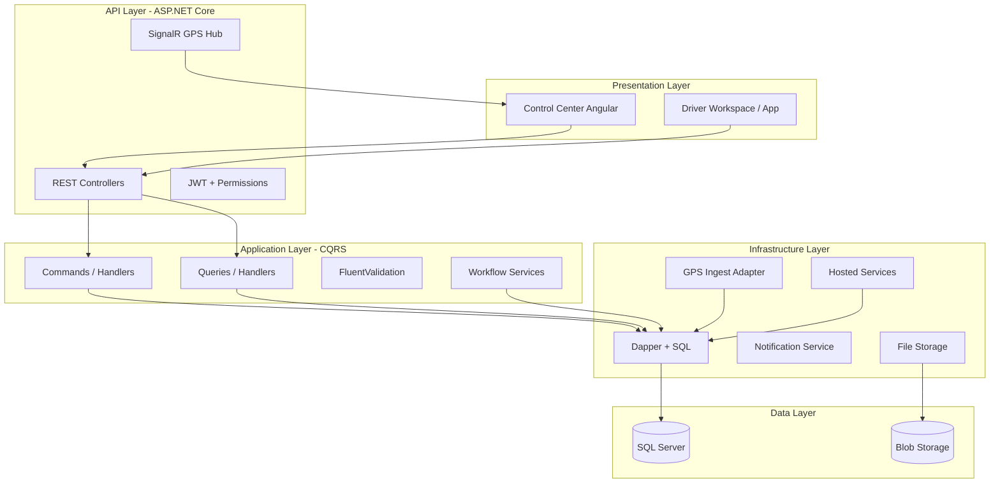

### 2.2 Design Principles

| Principle | Application |
|-----------|-------------|
| **Tenant isolation** | Every fleet table has `TenantId`; handlers use `ITenantContext` |
| **CQRS** | One command/query per use case; MediatR pipeline |
| **Workflow as service** | Status transitions centralized in `FleetLifecycleService` |
| **Compliance gate** | Assignment commands call `IComplianceValidator` before persist |
| **Adapter pattern** | GPS providers (Jimi One) behind `IGpsIngestAdapter` |
| **Audit everything critical** | Assignment, status change, compliance override logged |

### 2.3 API Conventions

| Convention | Value |
|------------|-------|
| Base URL | `/api` |
| Auth | `Authorization: Bearer {jwt}` |
| Tenant | Resolved from JWT `tenant_id` claim |
| Response envelope | `ApiResponse<T>` → unwrapped by Angular interceptor |
| Pagination | `?page=1&pageSize=20` |
| Filtering | Query params per resource |
| Errors | 400 validation, 401 auth, 403 permission, 404 not found, 409 conflict |

---

## 3. API List

Legend: **✓** = exists today · **+** = proposed (Phase 3 build)

### 3.1 Fleet Dashboard

| Method | Endpoint | Status | Description | Permission |
|--------|----------|--------|-------------|------------|
| GET | `/api/dashboard/summary` | ✓ | Fleet KPIs, counts, recent activity | `Dashboard.View` |
| GET | `/api/fleet/dashboard` | + | Extended fleet summary (utilization, compliance alerts) | `Fleet.Dashboard.View` |
| GET | `/api/fleet/dashboard/alerts` | + | Active maintenance, compliance, GPS alerts | `Fleet.Dashboard.View` |

### 3.2 Vehicle Management

| Method | Endpoint | Status | Description | Permission |
|--------|----------|--------|-------------|------------|
| GET | `/api/vehicles` | ✓ | List vehicles (filter, paginate) | `Vehicle.View` |
| GET | `/api/vehicles/{id}` | ✓ | Vehicle detail | `Vehicle.View` |
| POST | `/api/vehicles` | ✓ | Register vehicle | `Vehicle.Create` |
| PUT | `/api/vehicles/{id}` | ✓ | Update vehicle | `Vehicle.Update` |
| DELETE | `/api/vehicles/{id}` | ✓ | Soft delete | `Vehicle.Delete` |
| PUT | `/api/vehicles/{id}/status` | + | Lifecycle status transition | `Vehicle.Update` |
| GET | `/api/vehicles/{id}/documents` | ✓ | List vehicle documents | `Vehicle.View` |
| POST | `/api/vehicles/{id}/documents` | ✓ | Upload document metadata | `Vehicle.Update` |
| DELETE | `/api/vehicles/{id}/documents/{docId}` | + | Remove document | `Vehicle.Update` |
| GET | `/api/vehicles/{id}/timeline` | + | Lifecycle events (assignments, maintenance, inspections) | `Vehicle.View` |
| PUT | `/api/vehicles/{id}/branch` | + | Assign branch/department | `Vehicle.Update` |
| POST | `/api/vehicles/{id}/retire` | + | Decommission vehicle | `Vehicle.Update` |

### 3.3 Driver Management

| Method | Endpoint | Status | Description | Permission |
|--------|----------|--------|-------------|------------|
| GET | `/api/drivers` | ✓ | List drivers | `Driver.View` |
| GET | `/api/drivers/{id}` | ✓ | Driver detail | `Driver.View` |
| POST | `/api/drivers` | ✓ | Register driver | `Driver.Manage` |
| PUT | `/api/drivers/{id}` | ✓ | Update driver | `Driver.Manage` |
| DELETE | `/api/drivers/{id}` | ✓ | Soft delete | `Driver.Manage` |
| PUT | `/api/drivers/{id}/status` | + | Lifecycle status transition | `Driver.Manage` |
| GET | `/api/drivers/{id}/documents` | + | List driver compliance documents | `Driver.View` |
| POST | `/api/drivers/{id}/documents` | + | Upload driver document | `Driver.Manage` |
| POST | `/api/drivers/{id}/verify` | + | Mark verification complete | `Compliance.Manage` |
| GET | `/api/drivers/{id}/performance` | + | Violations, fuel efficiency, trips | `Driver.View` |
| PUT | `/api/drivers/{id}/branch` | + | Assign branch/department | `Driver.Manage` |

### 3.4 Assignments & Trips (Bookings)

| Method | Endpoint | Status | Description | Permission |
|--------|----------|--------|-------------|------------|
| GET | `/api/bookings` | ✓ | List trips/bookings | `Booking.View` |
| GET | `/api/bookings/{id}` | ✓ | Trip detail | `Booking.View` |
| POST | `/api/bookings` | ✓ | Create booking | `Booking.Create` |
| PUT | `/api/bookings/{id}` | ✓ | Update booking | `Booking.Update` |
| PUT | `/api/bookings/{id}/status` | ✓ | Update trip status | `Booking.Update` |
| PUT | `/api/bookings/{id}/assign-driver` | ✓ | Assign driver (+ compliance check) | `Booking.Assign` |
| PUT | `/api/bookings/{id}/assign-vehicle` | ✓ | Assign vehicle (+ compliance check) | `Booking.Assign` |
| POST | `/api/bookings/{id}/start` | + | Start trip → sync vehicle/driver status | `Booking.Update` |
| POST | `/api/bookings/{id}/complete` | + | Complete trip → release vehicle/driver | `Booking.Update` |
| POST | `/api/vehicles/{id}/reserve` | + | Reserve vehicle for date range | `Booking.Assign` |
| GET | `/api/assignments` | + | Assignment history audit log | `Booking.View` |
| GET | `/api/dispatch/board` | + | Available vehicles/drivers + pending trips | `Booking.Assign` |

### 3.5 GPS Tracking

| Method | Endpoint | Status | Description | Permission |
|--------|----------|--------|-------------|------------|
| POST | `/api/gps/positions` | ✓ | Ingest position (device/webhook) | `GPS.Ingest` |
| GET | `/api/gps/live` | ✓ | All live vehicle positions | `GPS.View` |
| GET | `/api/gps/history/{vehicleId}` | ✓ | Position history | `GPS.View` |
| GET | `/api/gps/trips` | ✓ | GPS trip segments | `GPS.View` |
| GET | `/api/gps/devices` | ✓ | List GPS devices | `GPS.Manage` |
| POST | `/api/gps/devices` | ✓ | Register device | `GPS.Manage` |
| PUT | `/api/gps/devices/{id}` | + | Update device / link vehicle | `GPS.Manage` |
| GET | `/api/gps/geofences` | ✓ | List geofences | `GPS.View` |
| POST | `/api/gps/geofences` | ✓ | Create geofence | `GPS.Manage` |
| GET | `/api/gps/alerts/rules` | ✓ | Alert rule config | `GPS.Manage` |
| POST | `/api/gps/alerts/rules` | ✓ | Create alert rule | `GPS.Manage` |
| GET | `/api/gps/alerts/events` | ✓ | Alert events | `GPS.View` |
| POST | `/api/gps/alerts/events/{id}/acknowledge` | ✓ | Acknowledge alert | `GPS.View` |
| POST | `/api/gps/commands/send` | ✓ | Send device command | `GPS.Manage` |
| GET | `/api/gps/eta` | ✓ | ETA calculation | `GPS.View` |
| POST | `/api/gps/webhooks/jimi` | + | Jimi One webhook receiver | `GPS.Ingest` |
| GET | `/api/gps/reports/idle` | + | Idle time report | `Report.View` |
| GET | `/api/gps/reports/distance` | + | Distance travelled report | `Report.View` |

### 3.6 Fuel Management

| Method | Endpoint | Status | Description | Permission |
|--------|----------|--------|-------------|------------|
| GET | `/api/fuellogs` | ✓ | List fuel logs | `Fuel.View` |
| GET | `/api/fuellogs/{id}` | ✓ | Fuel log detail | `Fuel.View` |
| POST | `/api/fuellogs` | ✓ | Create fuel log | `Fuel.Create` |
| PUT | `/api/fuellogs/{id}` | ✓ | Update fuel log | `Fuel.Update` |
| DELETE | `/api/fuellogs/{id}` | ✓ | Delete fuel log | `Fuel.Delete` |
| GET | `/api/fuellogs/analytics` | + | Cost/km, efficiency, comparison | `Fuel.View` |
| GET | `/api/fuellogs/reports/monthly` | + | Monthly fuel cost report | `Report.View` |

### 3.7 Maintenance

| Method | Endpoint | Status | Description | Permission |
|--------|----------|--------|-------------|------------|
| GET | `/api/maintenance` | ✓ | List maintenance records | `Maintenance.View` |
| GET | `/api/maintenance/{id}` | ✓ | Maintenance detail | `Maintenance.View` |
| POST | `/api/maintenance` | ✓ | Create maintenance record | `Maintenance.Manage` |
| PUT | `/api/maintenance/{id}` | ✓ | Update record | `Maintenance.Manage` |
| PUT | `/api/maintenance/{id}/status` | ✓ | Update status (→ vehicle status sync) | `Maintenance.Manage` |
| DELETE | `/api/maintenance/{id}` | ✓ | Delete record | `Maintenance.Manage` |
| GET | `/api/maintenance/due` | + | Upcoming / overdue services | `Maintenance.View` |
| GET | `/api/maintenance/rules` | + | List maintenance rules per vehicle | `Maintenance.Manage` |
| POST | `/api/maintenance/rules` | + | Create rule (mileage/date/hours) | `Maintenance.Manage` |

### 3.8 Inspections (New Module)

| Method | Endpoint | Status | Description | Permission |
|--------|----------|--------|-------------|------------|
| GET | `/api/inspections` | + | List inspections | `Inspection.View` |
| GET | `/api/inspections/{id}` | + | Inspection detail + checklist | `Inspection.View` |
| POST | `/api/inspections` | + | Create inspection | `Inspection.Manage` |
| PUT | `/api/inspections/{id}` | + | Update inspection | `Inspection.Manage` |
| PUT | `/api/inspections/{id}/complete` | + | Submit result (Pass/Warning/Fail) | `Inspection.Manage` |
| GET | `/api/inspections/templates` | + | Checklist templates | `Inspection.View` |
| POST | `/api/inspections/{id}/photos` | + | Attach inspection photos | `Inspection.Manage` |

### 3.9 Compliance (New Module)

| Method | Endpoint | Status | Description | Permission |
|--------|----------|--------|-------------|------------|
| GET | `/api/compliance/summary` | + | Dashboard: expiring / expired counts | `Compliance.View` |
| GET | `/api/compliance/documents` | + | List all compliance documents | `Compliance.View` |
| GET | `/api/compliance/documents/{id}` | + | Document detail | `Compliance.View` |
| POST | `/api/compliance/documents` | + | Register compliance document | `Compliance.Manage` |
| PUT | `/api/compliance/documents/{id}` | + | Update document / expiry | `Compliance.Manage` |
| GET | `/api/compliance/validate` | + | Pre-check vehicle+driver for assignment | `Compliance.View` |
| GET | `/api/compliance/reports/expiry` | + | Insurance / license expiry report | `Report.View` |

### 3.10 Expenses

| Method | Endpoint | Status | Description | Permission |
|--------|----------|--------|-------------|------------|
| GET | `/api/fleet/expenses` | + | List fleet expenses (non-fuel) | `Expense.View` |
| POST | `/api/fleet/expenses` | + | Record expense | `Expense.Manage` |
| GET | `/api/fleet/expenses/reports/monthly` | + | Monthly expense summary | `Report.View` |

### 3.11 Reports & Export

| Method | Endpoint | Status | Description | Permission |
|--------|----------|--------|-------------|------------|
| GET | `/api/reports/bookings` | ✓ | Booking report | `Report.View` |
| GET | `/api/reports/revenue` | ✓ | Revenue report | `Report.View` |
| GET | `/api/reports/vehicle-profit` | ✓ | Vehicle profit | `Report.View` |
| GET | `/api/reports/driver-performance` | ✓ | Driver performance | `Report.View` |
| GET | `/api/reports/fleet-summary` | + | Fleet status summary | `Report.View` |
| GET | `/api/reports/fleet-utilization` | + | Utilization % by vehicle | `Report.View` |
| GET | `/api/reports/maintenance-cost` | + | Maintenance cost report | `Report.View` |
| GET | `/api/reports/compliance-expiry` | + | Compliance expiry report | `Report.View` |
| GET | `/api/reports/export/{reportKey}` | + | Excel / PDF export | `Report.Export` |

### 3.12 Notifications

| Method | Endpoint | Status | Description | Permission |
|--------|----------|--------|-------------|------------|
| GET | `/api/notifications` | ✓ | User notifications | Authenticated |
| PUT | `/api/notifications/{id}/read` | ✓ | Mark read | Authenticated |
| GET | `/api/notifications/preferences` | + | User alert preferences | Authenticated |
| PUT | `/api/notifications/preferences` | + | Update preferences | Authenticated |

### 3.13 Driver App

| Method | Endpoint | Status | Description | Permission |
|--------|----------|--------|-------------|------------|
| POST | `/api/driver-app/login` | ✓ | Driver authentication | Anonymous |
| GET | `/api/driver-app/trips` | ✓ | Assigned trips | Driver |
| POST | `/api/driver-app/trips/{id}/start` | ✓ | Start trip | Driver |
| POST | `/api/driver-app/trips/{id}/complete` | ✓ | Complete trip | Driver |
| POST | `/api/driver-app/location` | ✓ | Report location | Driver |
| POST | `/api/driver-app/fuel` | ✓ | Log fuel | Driver |

### 3.14 Platform & Settings

| Method | Endpoint | Status | Description | Permission |
|--------|----------|--------|-------------|------------|
| GET | `/api/settings/categories` | ✓ | Settings sidebar categories | `Platform.Settings.View` |
| GET | `/api/settings/{category}` | ✓ | Category values | `Platform.Settings.View` |
| PUT | `/api/settings/{category}` | ✓ | Update category values | `Platform.Settings.Manage` |

---

## 4. Database Candidate Tables

Legend: **✓** = exists · **~** = extend existing · **+** = new table

### 4.1 Core Fleet (Existing)

#### Vehicles ✓

| Column | Type | Notes |
|--------|------|-------|
| Id | INT PK | |
| TenantId | INT FK | Multi-tenant |
| Name | NVARCHAR(200) | |
| RegistrationNumber | NVARCHAR(50) | Unique per tenant |
| Model, Year | NVARCHAR, INT | |
| SeatingCapacity | INT | |
| FuelAverage, FuelType | DECIMAL, INT | |
| CurrentMileage | DECIMAL | Odometer |
| InsuranceExpiryDate | DATETIME2 | Legacy; migrate to ComplianceDocuments |
| Status | INT | Enum: extend for New, Assigned |
| BranchId | INT FK NULL | **+ add** |
| DepartmentId | INT FK NULL | **+ add** |
| GpsDeviceId | INT FK NULL | **+ add** direct link |
| IsDeleted, CreatedAt, UpdatedAt | | BaseEntity |

#### Drivers ✓

| Column | Type | Notes |
|--------|------|-------|
| Id | INT PK | |
| TenantId | INT FK | |
| DriverCode | NVARCHAR(20) | **+ add** |
| FullName, Phone | NVARCHAR | |
| LicenseNumber, LicenseExpiryDate | NVARCHAR, DATETIME2 | |
| Nationality | NVARCHAR(100) | **+ add** |
| CNIC, Address | NVARCHAR | |
| Status | INT | Extend: OnLeave |
| UserId | INT FK NULL | Driver app login |
| BranchId | INT FK NULL | **+ add** |
| DepartmentId | INT FK NULL | **+ add** |
| VerificationStatus | NVARCHAR(20) | **+ add** Pending/Verified/Rejected |
| IsDeleted, CreatedAt | | |

#### Bookings (Trips) ✓

| Column | Type | Notes |
|--------|------|-------|
| Id, TenantId | | |
| BookingNumber | NVARCHAR | |
| CustomerId, RouteId | INT FK | |
| VehicleId, DriverId | INT FK NULL | Assignment |
| PickupTime, DropoffTime | DATETIME2 | |
| Status | INT | Pending→Completed |
| IsDeleted | BIT | |

### 4.2 Operations (Existing)

#### FuelLogs ✓ · Maintenance ✓ · VehicleDocuments ✓

Existing schemas are sufficient for Phase 3. Extend `Maintenance` with:

| Column | Type | Notes |
|--------|------|-------|
| VendorName | NVARCHAR(200) | **+ add** |
| WorkshopName | NVARCHAR(200) | **+ add** |
| InvoiceNumber | NVARCHAR(100) | **+ add** |
| PartsUsedJson | NVARCHAR(MAX) | **+ add** JSON array |
| MaintenanceType | NVARCHAR(50) | **+ add** Preventive/Corrective |
| TriggerType | NVARCHAR(50) | **+ add** Mileage/Date/EngineHours |

### 4.3 GPS (Existing)

| Table | Status | Purpose |
|-------|--------|---------|
| GpsDevices | ✓ | Device registry, IMEI, vehicle link |
| GpsPositions | ✓ | Position history (lat, lng, speed, ignition) |
| VehicleCurrentLocation | ✓ | Latest position per vehicle |
| GpsTrips | ✓ | Trip segments from GPS |
| Geofences | ✓ | Geofence definitions |
| GpsAlertRules | ✓ | Speed, geofence rules |
| GpsAlertEvents | ✓ | Triggered alerts |
| GpsDeviceCommands | ✓ | Remote commands |

**Extend GpsDevices:**

| Column | Type | Notes |
|--------|------|-------|
| ProviderName | NVARCHAR(50) | **+ add** `JimiOne` |
| ExternalDeviceId | NVARCHAR(100) | **+ add** Provider device ID |
| LastHeartbeatAt | DATETIME2 | **+ add** Device health |
| SignalStatus | NVARCHAR(20) | **+ add** Online/Offline |

### 4.4 New Tables (Phase 3 Build)

#### ComplianceDocuments +

```sql
CREATE TABLE ComplianceDocuments (
    Id              INT IDENTITY(1,1) PRIMARY KEY,
    TenantId        INT NOT NULL,
    EntityType      NVARCHAR(20) NOT NULL,   -- Vehicle | Driver
    EntityId        INT NOT NULL,
    DocumentType    NVARCHAR(50) NOT NULL,   -- Insurance, Registration, License, Medical, Permit, Pollution
    DocumentNumber  NVARCHAR(100) NULL,
    FileUrl         NVARCHAR(500) NULL,
    IssuedDate      DATETIME2 NULL,
    ExpiryDate      DATETIME2 NOT NULL,
    IsMandatory     BIT NOT NULL DEFAULT 1,
    Status          NVARCHAR(20) NOT NULL DEFAULT N'Valid',  -- Valid | ExpiringSoon | Expired
    Notes           NVARCHAR(500) NULL,
    CreatedAt       DATETIME2 NOT NULL DEFAULT GETUTCDATE(),
    UpdatedAt       DATETIME2 NULL,
    CONSTRAINT FK_ComplianceDocuments_Tenants FOREIGN KEY (TenantId) REFERENCES Tenants(Id)
);
CREATE INDEX IX_ComplianceDocuments_Tenant_Entity ON ComplianceDocuments (TenantId, EntityType, EntityId);
CREATE INDEX IX_ComplianceDocuments_Expiry ON ComplianceDocuments (TenantId, ExpiryDate) WHERE Status <> N'Expired';
```

#### Inspections +

```sql
CREATE TABLE Inspections (
    Id              INT IDENTITY(1,1) PRIMARY KEY,
    TenantId        INT NOT NULL,
    VehicleId       INT NOT NULL,
    InspectorUserId INT NULL,
    InspectionDate  DATETIME2 NOT NULL DEFAULT GETUTCDATE(),
    ChecklistJson   NVARCHAR(MAX) NOT NULL,  -- Structured checklist items + scores
    PhotosJson      NVARCHAR(MAX) NULL,       -- Array of file URLs
    Comments        NVARCHAR(MAX) NULL,
    Result          NVARCHAR(20) NOT NULL,    -- Pass | Warning | Fail
    Status          NVARCHAR(20) NOT NULL DEFAULT N'Draft',  -- Draft | Completed
    CreatedAt       DATETIME2 NOT NULL DEFAULT GETUTCDATE(),
    UpdatedAt       DATETIME2 NULL,
    CONSTRAINT FK_Inspections_Tenants FOREIGN KEY (TenantId) REFERENCES Tenants(Id),
    CONSTRAINT FK_Inspections_Vehicles FOREIGN KEY (VehicleId) REFERENCES Vehicles(Id)
);
```

#### InspectionTemplates +

```sql
CREATE TABLE InspectionTemplates (
    Id          INT IDENTITY(1,1) PRIMARY KEY,
    TenantId    INT NOT NULL,
    Name        NVARCHAR(100) NOT NULL,
    ItemsJson   NVARCHAR(MAX) NOT NULL,  -- Default checklist structure
    IsActive    BIT NOT NULL DEFAULT 1,
    CreatedAt   DATETIME2 NOT NULL DEFAULT GETUTCDATE()
);
```

#### MaintenanceRules +

```sql
CREATE TABLE MaintenanceRules (
    Id              INT IDENTITY(1,1) PRIMARY KEY,
    TenantId        INT NOT NULL,
    VehicleId       INT NULL,              -- NULL = tenant-wide default
    RuleType        NVARCHAR(20) NOT NULL, -- Mileage | Date | EngineHours
    ServiceName     NVARCHAR(100) NOT NULL,
    IntervalValue   INT NOT NULL,          -- km, days, or hours
    LastTriggeredAt DATETIME2 NULL,
    LastMileage     DECIMAL(18,2) NULL,
    IsActive        BIT NOT NULL DEFAULT 1,
    CreatedAt       DATETIME2 NOT NULL DEFAULT GETUTCDATE()
);
```

#### AssignmentHistory +

```sql
CREATE TABLE AssignmentHistory (
    Id          INT IDENTITY(1,1) PRIMARY KEY,
    TenantId    INT NOT NULL,
    BookingId   INT NOT NULL,
    VehicleId   INT NULL,
    DriverId    INT NULL,
    Action      NVARCHAR(50) NOT NULL,   -- Assigned | Unassigned | Started | Completed
    ActionByUserId INT NULL,
    ActionAt    DATETIME2 NOT NULL DEFAULT GETUTCDATE(),
    Notes       NVARCHAR(500) NULL,
    CONSTRAINT FK_AssignmentHistory_Bookings FOREIGN KEY (BookingId) REFERENCES Bookings(Id)
);
```

#### VehicleReservations +

```sql
CREATE TABLE VehicleReservations (
    Id          INT IDENTITY(1,1) PRIMARY KEY,
    TenantId    INT NOT NULL,
    VehicleId   INT NOT NULL,
    ReservedFrom DATETIME2 NOT NULL,
    ReservedTo   DATETIME2 NOT NULL,
    ReservedByUserId INT NULL,
    Purpose     NVARCHAR(200) NULL,
    Status      NVARCHAR(20) NOT NULL DEFAULT N'Active',  -- Active | Cancelled | Fulfilled
    CreatedAt   DATETIME2 NOT NULL DEFAULT GETUTCDATE()
);
```

#### FleetExpenses +

```sql
CREATE TABLE FleetExpenses (
    Id          INT IDENTITY(1,1) PRIMARY KEY,
    TenantId    INT NOT NULL,
    VehicleId   INT NULL,
    DriverId    INT NULL,
    Category    NVARCHAR(50) NOT NULL,   -- Toll, Parking, Fine, Other
    Amount      DECIMAL(18,2) NOT NULL,
    CurrencyCode NVARCHAR(10) NOT NULL DEFAULT N'AED',
    ExpenseDate DATETIME2 NOT NULL,
    Description NVARCHAR(500) NULL,
    ReceiptUrl  NVARCHAR(500) NULL,
    CreatedAt   DATETIME2 NOT NULL DEFAULT GETUTCDATE()
);
```

#### DriverPerformanceEvents +

```sql
CREATE TABLE DriverPerformanceEvents (
    Id          INT IDENTITY(1,1) PRIMARY KEY,
    TenantId    INT NOT NULL,
    DriverId    INT NOT NULL,
    EventType   NVARCHAR(50) NOT NULL,   -- SpeedViolation | Complaint | Incident | Praise
    EventDate   DATETIME2 NOT NULL,
    Severity    NVARCHAR(20) NULL,       -- Low | Medium | High
    Description NVARCHAR(MAX) NULL,
    BookingId   INT NULL,
    CreatedAt   DATETIME2 NOT NULL DEFAULT GETUTCDATE()
);
```

### 4.5 Entity Relationship (Target)

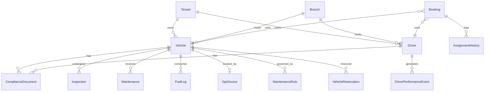

### 4.6 Index Strategy

| Table | Index | Purpose |
|-------|-------|---------|
| ComplianceDocuments | `(TenantId, ExpiryDate)` | Daily expiry scan |
| GpsPositions | `(VehicleId, Timestamp DESC)` | History queries |
| AssignmentHistory | `(TenantId, BookingId)` | Audit trail |
| Inspections | `(TenantId, VehicleId, InspectionDate DESC)` | Vehicle profile |
| MaintenanceRules | `(TenantId, VehicleId, IsActive)` | Due service calculation |

---

## 5. Integration Plan

### 5.1 Integration Map

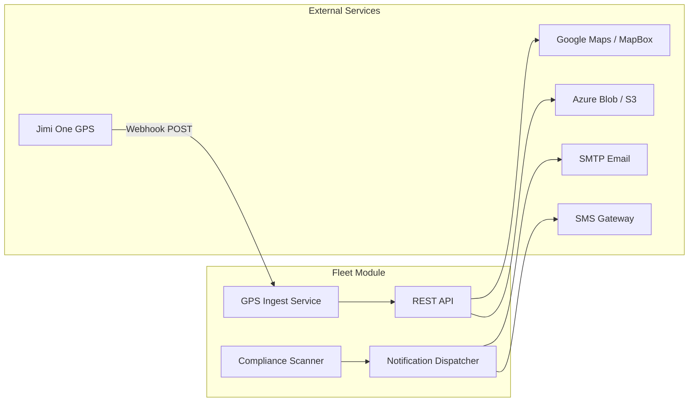

### 5.2 Jimi One GPS Integration

| Phase | Task | Details |
|-------|------|---------|
| **1** | Define `IGpsIngestAdapter` interface | `IngestPositionAsync`, `IngestBatchAsync`, `MapDeviceToVehicle` |
| **2** | Implement `JimiOneGpsAdapter` | Parse Jimi webhook payload → `GpsPositionDto` |
| **3** | Webhook endpoint | `POST /api/gps/webhooks/jimi` with API key validation |
| **4** | Device registration | Map Jimi IMEI → `GpsDevices.ExternalDeviceId` |
| **5** | Alert evaluation | Reuse existing `GpsAlertRules` engine on ingest |
| **6** | Device health | Update `LastHeartbeatAt`, set `SignalStatus` on timeout |
| **7** | Commands | Map Jimi command API to `GpsDeviceCommands` |

**Jimi webhook payload mapping:**

| Jimi Field | System Field |
|------------|--------------|
| `imei` | `GpsDevices.ExternalDeviceId` |
| `lat` / `lng` | `GpsPositions.Latitude/Longitude` |
| `speed` | `GpsPositions.Speed` |
| `acc` (ignition) | `GpsPositions.Ignition` |
| `gpsTime` | `GpsPositions.Timestamp` |

### 5.3 Maps Integration

| Use Case | Integration | Config Key |
|----------|-------------|------------|
| Live map display | Google Maps JS API or MapBox GL | `Integrations.GoogleMapsApiKey` |
| Geocoding | Google Geocoding API | Settings → Integrations |
| Route display | Polyline from `GpsPositions` | Internal |
| ETA | Existing `/api/gps/eta` | Extend with maps distance |

### 5.4 Notification Integration

| Channel | Trigger | Implementation |
|---------|---------|----------------|
| **In-app** | All fleet alerts | Existing `Notifications` table |
| **Email** | Compliance 30/15/7-day, maintenance due | SMTP from Settings → Notifications |
| **SMS** | Critical: expired compliance, emergency GPS | SMS gateway API key from Settings |
| **Push** | Driver trip assigned | Future mobile app |

**Scheduled jobs:**

| Job | Schedule | Action |
|-----|----------|--------|
| `ComplianceScannerJob` | Daily 06:00 UTC | Scan `ComplianceDocuments`, update status, create notifications |
| `MaintenanceDueJob` | Daily 06:30 UTC | Evaluate `MaintenanceRules`, alert overdue |
| `GpsHealthCheckJob` | Every 5 min | Mark devices offline if no heartbeat > 15 min |
| `GpsRetentionJob` | Daily | Purge positions older than retention policy |

### 5.5 File Storage Integration

| Document Type | Storage | Path Pattern |
|---------------|---------|--------------|
| Vehicle documents | Azure Blob / S3 / Local | `{tenantId}/vehicles/{vehicleId}/{docType}/{filename}` |
| Driver documents | Same | `{tenantId}/drivers/{driverId}/{docType}/{filename}` |
| Inspection photos | Same | `{tenantId}/inspections/{inspectionId}/{filename}` |
| Expense receipts | Same | `{tenantId}/expenses/{expenseId}/{filename}` |

Configured via Settings → File Management (`StorageProvider`, `MaxFileSizeMb`).

### 5.6 Integration Sequence (Build Order)

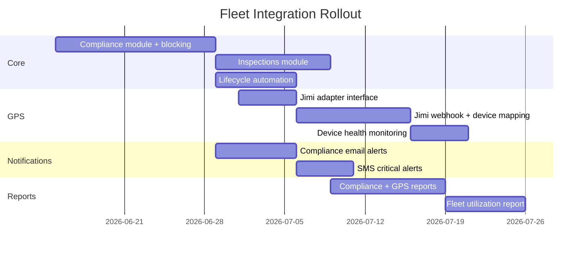

---

## 6. Workflow Definitions

### 6.1 Vehicle Registration Workflow

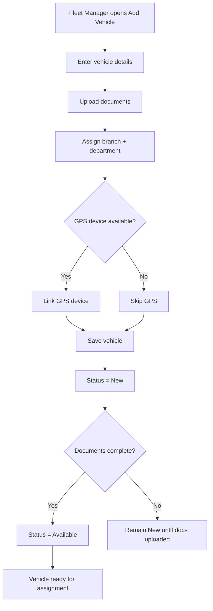

**Rules:**
- BR-V-01: Registration number unique per tenant
- BR-V-02: Cannot transition New → Available without at least insurance document on file
- BR-V-03: GPS link optional at registration; required before first trip (configurable)

### 6.2 Trip Assignment Workflow

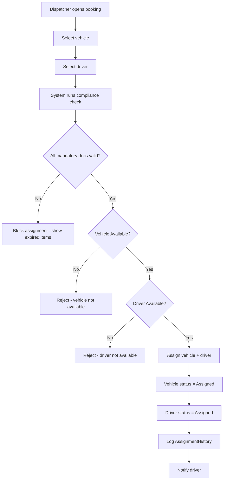

**Compliance check queries:**
```sql
-- Block if any mandatory document expired
SELECT COUNT(*) FROM ComplianceDocuments
WHERE TenantId = @TenantId
  AND EntityType = @EntityType AND EntityId = @EntityId
  AND IsMandatory = 1 AND ExpiryDate < GETUTCDATE()
```

### 6.3 Trip Execution Workflow

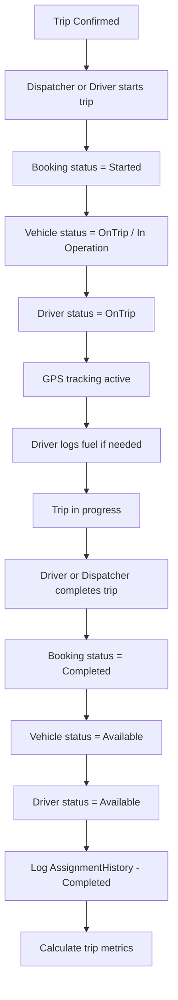

### 6.4 Maintenance Workflow

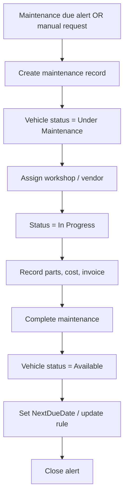

**Automated triggers:**
- `MaintenanceDueJob` compares `CurrentMileage` against `MaintenanceRules.IntervalValue`
- `MaintenanceDueJob` compares `NextDueDate` on maintenance records
- On create: `FleetLifecycleService.SetVehicleStatus(vehicleId, Maintenance)`

### 6.5 Inspection Workflow

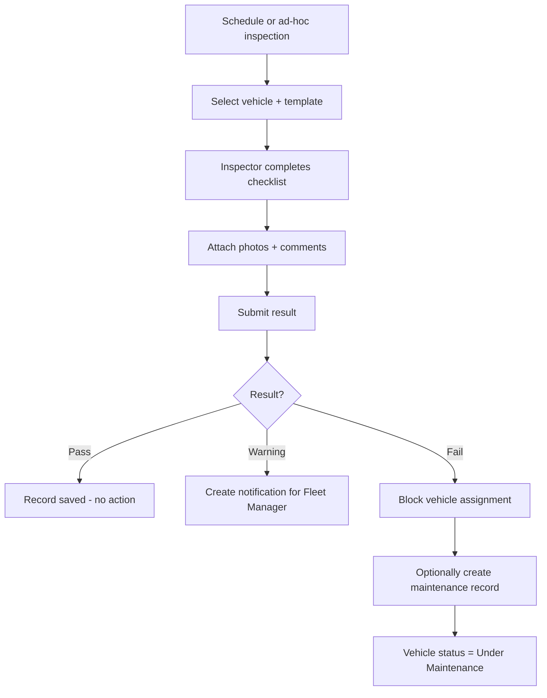

### 6.6 Compliance Monitoring Workflow

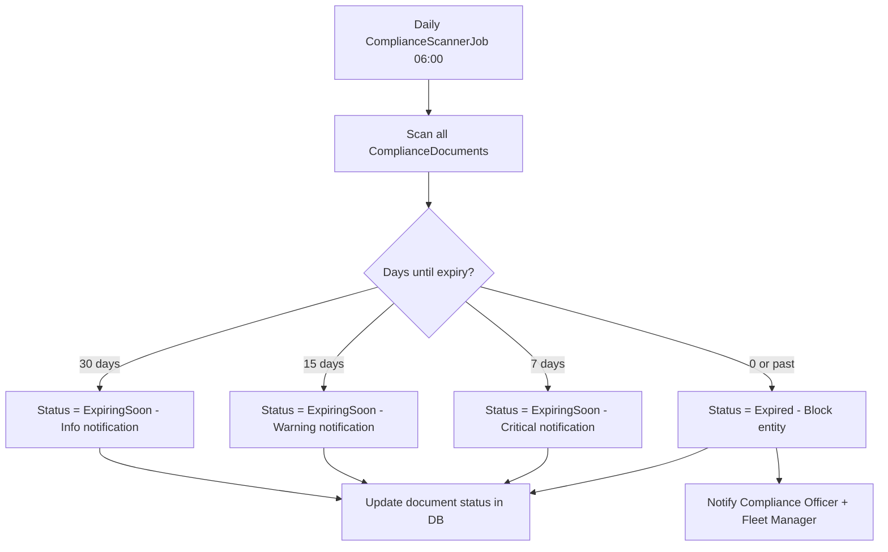

### 6.7 Driver Onboarding Workflow

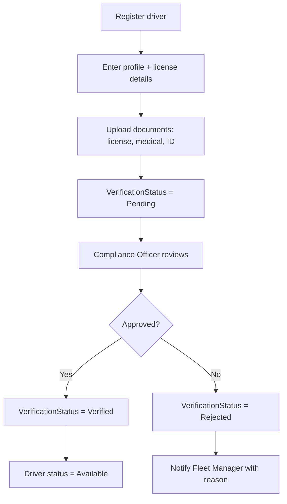

---

## 7. State Machines

### 7.1 Vehicle Status State Machine

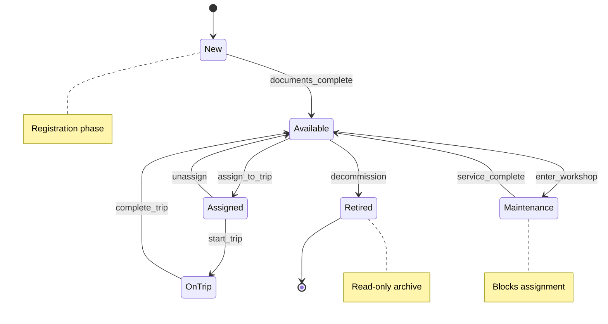

**Proposed enum extension:**

```csharp
public enum VehicleStatus
{
    New = 0,
    Available = 1,
    Assigned = 2,
    OnTrip = 3,        // was OnTrip
    Maintenance = 4,
    Retired = 5
}
```

### 7.2 Driver Status State Machine

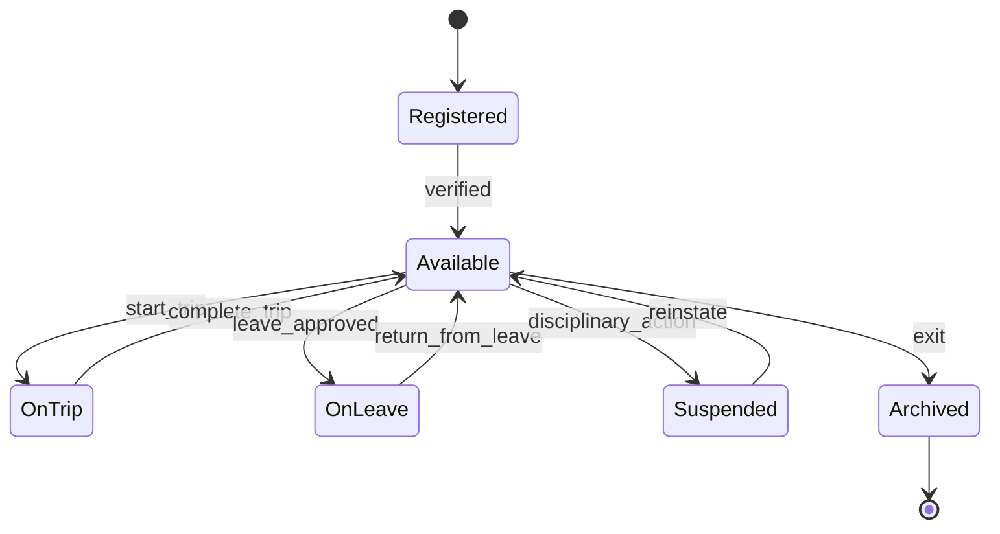

### 7.3 Booking (Trip) Status State Machine

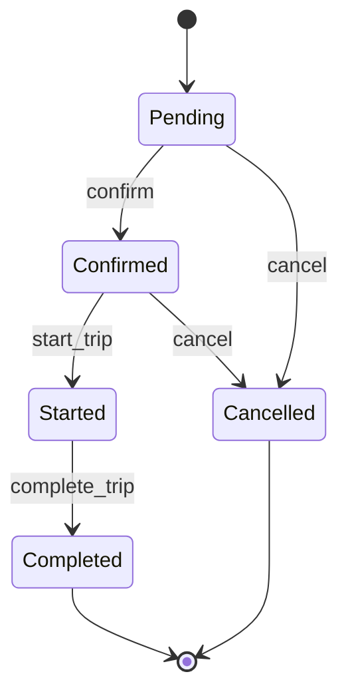

### 7.4 Central Lifecycle Service

All status transitions go through one service to keep vehicle, driver, and booking in sync:

```csharp
public interface IFleetLifecycleService
{
    Task StartTripAsync(int bookingId, int userId, CancellationToken ct);
    Task CompleteTripAsync(int bookingId, int userId, CancellationToken ct);
    Task EnterMaintenanceAsync(int vehicleId, int maintenanceId, CancellationToken ct);
    Task ExitMaintenanceAsync(int vehicleId, int maintenanceId, CancellationToken ct);
    Task SetVehicleStatusAsync(int vehicleId, VehicleStatus status, string reason, CancellationToken ct);
    Task SetDriverStatusAsync(int driverId, DriverStatus status, string reason, CancellationToken ct);
}
```

---

## 8. Notification & Alert Design

### 8.1 Alert Types

| Alert Code | Source | Severity | Channels |
|------------|--------|----------|----------|
| `COMPLIANCE_EXPIRING_30` | ComplianceScanner | Info | In-app, Email |
| `COMPLIANCE_EXPIRING_15` | ComplianceScanner | Warning | In-app, Email |
| `COMPLIANCE_EXPIRING_7` | ComplianceScanner | Critical | In-app, Email, SMS |
| `COMPLIANCE_EXPIRED` | ComplianceScanner | Critical | In-app, Email, SMS |
| `MAINTENANCE_DUE` | MaintenanceDueJob | Warning | In-app, Email |
| `MAINTENANCE_OVERDUE` | MaintenanceDueJob | Critical | In-app, Email |
| `GPS_OVERSPEED` | GpsIngest | Warning | In-app |
| `GPS_OFFLINE` | GpsHealthCheck | Warning | In-app, Email |
| `GPS_GEOFENCE_BREACH` | GpsIngest | Critical | In-app, SMS |
| `GPS_IDLE` | GpsIngest | Info | In-app |
| `INSPECTION_FAIL` | Inspection complete | Critical | In-app, Email |
| `TRIP_ASSIGNED` | Assignment | Info | In-app (driver) |

### 8.2 Notification Payload

```json
{
  "type": "COMPLIANCE_EXPIRING_7",
  "title": "Insurance expiring in 7 days",
  "message": "Vehicle VH-001 (Toyota Hiace) insurance expires on 2026-06-18",
  "entityType": "Vehicle",
  "entityId": 42,
  "severity": "Critical",
  "actionUrl": "/vehicles/42"
}
```

---

## 9. Security Design

### 9.1 New Permissions (Seed)

| Permission | Description |
|------------|-------------|
| `Fleet.Dashboard.View` | Fleet dashboard |
| `Vehicle.Create` / `Update` / `Delete` | Vehicle CRUD |
| `Driver.Manage` | Driver CRUD + status |
| `Booking.Assign` | Assign vehicle/driver |
| `Fuel.Create` / `Update` / `Delete` | Fuel log management |
| `Maintenance.Manage` | Maintenance CRUD |
| `Inspection.View` / `Inspection.Manage` | Inspection module |
| `Compliance.View` / `Compliance.Manage` | Compliance module |
| `Expense.View` / `Expense.Manage` | Fleet expenses |
| `GPS.Ingest` | Webhook/device ingest |
| `GPS.Manage` | Device/geofence admin |
| `Report.Export` | Excel/PDF export |

### 9.2 New Roles (Seed)

| Role Code | Key Permissions |
|-----------|-----------------|
| `BRANCH_MANAGER` | Vehicle.View, Driver.View, Booking.Assign (branch-scoped) |
| `MAINTENANCE_OFFICER` | Maintenance.*, Vehicle.View |
| `COMPLIANCE_OFFICER` | Compliance.*, Inspection.*, Vehicle.View, Driver.View |
| `FINANCE_OFFICER` | Fuel.View, Expense.View, Report.* |
| `REPORT_VIEWER` | Report.View, Report.Export |

### 9.3 Branch Scoping

```csharp
// In query handlers for branch-scoped roles:
if (userRole == "BRANCH_MANAGER")
    sql += " AND v.BranchId = @UserBranchId";
```

---

## 10. Frontend Module Map

| Angular Module | Route | New/Existing | Phase 3 Work |
|----------------|-------|--------------|--------------|
| `dashboard` | `/dashboard` | Existing | Extend fleet KPIs |
| `vehicles` | `/vehicles` | Existing | Branch filter, lifecycle status, timeline |
| `drivers` | `/drivers` | Existing | Verification, documents, performance |
| `bookings` | `/bookings` | Existing | Compliance block UI, start/complete |
| `dispatch` | `/dispatch` | **New** | Dispatch board |
| `gps-tracking` | `/gps-tracking` | Existing | Device health, Jimi status |
| `fuel-logs` | `/fuel-logs` | Existing | Enhanced analytics |
| `maintenance` | `/maintenance` | Existing | Rules, due list, vendor fields |
| `inspections` | `/inspections` | **New** | Checklist UI, photos, results |
| `compliance` | `/compliance` | **New** | Document registry, expiry dashboard |
| `fleet-expenses` | `/fleet-expenses` | **New** | Expense logging |
| `reports` | `/reports` | Existing | Compliance, GPS, utilization tabs |
| `settings` | `/settings` | Existing | Fleet-related settings categories |

---

## 11. Implementation Roadmap

### Sprint 1 — Compliance Foundation (P0)

| Task | API | Table |
|------|-----|-------|
| Create `ComplianceDocuments` table + migration | — | ComplianceDocuments |
| Compliance CRUD API | §3.9 | — |
| `IComplianceValidator` in assign handlers | §3.4 | — |
| Compliance dashboard UI | — | — |
| Extend `ComplianceScannerJob` | — | — |

### Sprint 2 — Inspections (P0)

| Task | API | Table |
|------|-----|-------|
| Create `Inspections` + `InspectionTemplates` | §3.8 | Inspections |
| Inspection checklist UI | — | — |
| Fail → block assignment rule | §3.4 | — |

### Sprint 3 — Lifecycle Automation (P1)

| Task | API | Table |
|------|-----|-------|
| `IFleetLifecycleService` | §3.4 start/complete | AssignmentHistory |
| Extend `VehicleStatus` enum | §3.2 status | — |
| Vehicle/driver status sync on trip | §6.3 | — |

### Sprint 4 — Branch Scoping (P1)

| Task | API | Table |
|------|-----|-------|
| Add `BranchId` to Vehicles/Drivers | §3.2, §3.3 | Vehicles, Drivers |
| Branch filter in queries | — | — |
| Seed `BRANCH_MANAGER` role | §9.2 | — |

### Sprint 5 — Maintenance Rules (P2)

| Task | API | Table |
|------|-----|-------|
| `MaintenanceRules` table + API | §3.7 | MaintenanceRules |
| `MaintenanceDueJob` | — | — |
| Maintenance → vehicle status sync | §6.4 | — |

### Sprint 6 — GPS Jimi Integration (P2)

| Task | API | Table |
|------|-----|-------|
| `JimiOneGpsAdapter` | §5.2 | GpsDevices extend |
| Webhook endpoint | §3.5 | — |
| Device health job | §5.4 | — |

### Sprint 7 — Reports & Expenses (P2–P3)

| Task | API | Table |
|------|-----|-------|
| Compliance/GPS/utilization reports | §3.11 | — |
| `FleetExpenses` module | §3.10 | FleetExpenses |
| Excel/PDF export | §3.11 | — |

---

## 12. Document Control

| Version | Date | Author | Changes |
|---------|------|--------|---------|
| 1.0 | June 2026 | System Design | Initial Phase 3 document |

**Related documents:**
- Phase 1: Requirement Gathering (conversation / BRD)
- Phase 2: [`11-fleet-phase-2-system-analysis.md`](./11-fleet-phase-2-system-analysis.md)
- Phase 4: Implementation (sprints — to be created)

---

*Sheikh Travel ERP — Fleet Management System — Phase 3 System Design*
