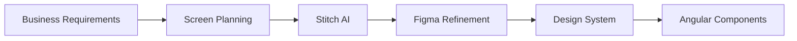
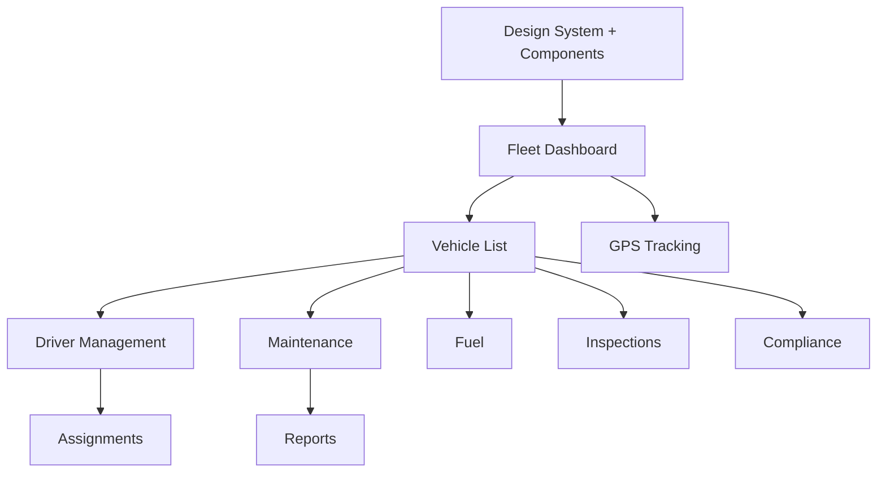
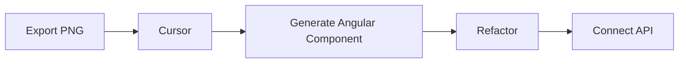

# Sheikh Travel ERP — Fleet Management System

## Phase 3: UI/UX Design

| Field | Value |
|-------|-------|
| **Product** | Sheikh Travel ERP — Fleet Management |
| **Document** | Phase 3 — UI/UX Design |
| **Version** | 1.0 |
| **Date** | June 2026 |
| **Input** | Phase 2 Analysis, Phase 3 System Design |
| **Workflow** | Business Requirements → Screen Planning → Stitch AI → Figma → Design System → Angular |

---

## Table of Contents

1. [Design Workflow](#1-design-workflow)
2. [Fleet Navigation](#2-fleet-navigation)
3. [Screen Inventory](#3-screen-inventory)
4. [Design System](#4-design-system)
5. [Component Library](#5-component-library)
6. [Stitch Development Order](#6-stitch-development-order)
7. [Figma File Structure](#7-figma-file-structure)
8. [Cursor Workflow](#8-cursor-workflow)
9. [Angular Component Tree](#9-angular-component-tree)
10. [Implementation Mapping](#10-implementation-mapping)

---

## 1. Design Workflow



Each screen flows through this pipeline once. The design system and shared component library are built first so no component is designed twice.

---

## 2. Fleet Navigation

```text
Fleet Management
├── Dashboard          → /fleet/dashboard      (new)
├── Vehicles           → /vehicles             (upgrade)
│    ├── Vehicle List
│    ├── Add Vehicle
│    └── Vehicle Details
├── Drivers            → /drivers              (upgrade)
│    ├── Driver List
│    ├── Add Driver
│    └── Driver Profile
├── Assignments        → /fleet/assignments    (new)
├── GPS Tracking       → /gps-tracking         (polish)
├── Maintenance        → /maintenance          (upgrade)
├── Fuel Management    → /fuel-logs            (upgrade)
├── Inspections        → /fleet/inspections    (new)
├── Compliance         → /fleet/compliance     (new)
├── Reports            → /reports              (extend)
└── Settings           → /settings             (existing)
```

### 2.1 Routing Strategy — Hybrid

| Route group | Implementation |
|-------------|----------------|
| `/fleet/*` (Dashboard, Assignments, Inspections, Compliance) | New `fleet-management` module with secondary sidebar |
| `/vehicles`, `/drivers`, `/gps-tracking`, `/fuel-logs`, `/maintenance`, `/reports` | Existing modules, upgraded UI in place |

Rationale: new fleet-only screens get a dedicated hub; existing modules with live data and APIs are not re-routed to avoid breaking bookmarks and integrations.

---

## 3. Screen Inventory

### Screen 1 — Fleet Dashboard

| Element | Detail |
|---------|--------|
| **Purpose** | Fleet overview at a glance |
| **Widgets** | Total Vehicles, Active Vehicles, Drivers On Duty, Maintenance Due, Fuel Cost, Compliance Alerts, Live GPS, Recent Activities |
| **Layout** | Stat cards row → utilization chart + fuel chart → maintenance alerts + live map → recent activity timeline |

### Screen 2 — Vehicle List

| Element | Detail |
|---------|--------|
| **Purpose** | Manage fleet vehicles |
| **Components** | Search, Filters, Vehicle Table, Status Badge, Add Vehicle, Export, Vehicle Drawer |
| **Drawer tabs** | General, Documents, Maintenance, Fuel, GPS |

### Screen 3 — Driver Management

| Element | Detail |
|---------|--------|
| **Purpose** | Manage drivers |
| **Components** | Statistics, Driver Table, License Status, Assigned Vehicle, Search, Filters, Driver Detail Panel, Timeline |

### Screen 4 — Assignments

| Element | Detail |
|---------|--------|
| **Purpose** | Assign vehicles to drivers/trips |
| **Components** | Vehicle Availability, Driver Availability, Assignment Calendar, Assignment Table, Assign button |

### Screen 5 — GPS Tracking

| Element | Detail |
|---------|--------|
| **Purpose** | Real-time tracking |
| **Components** | Live Map, Vehicle List, Current Location, Speed, Ignition, Trip History, Geofence Alerts |

### Screen 6 — Maintenance

| Element | Detail |
|---------|--------|
| **Purpose** | Service planning |
| **Components** | Calendar, Service Due, Workshop, Cost, Vehicle History, Status |

### Screen 7 — Fuel Management

| Element | Detail |
|---------|--------|
| **Purpose** | Fuel monitoring |
| **Components** | Fuel Log Table, Monthly Chart, Vehicle Comparison, Fuel Efficiency Card |

### Screen 8 — Inspections

| Element | Detail |
|---------|--------|
| **Purpose** | Vehicle checklist |
| **Components** | Checklist, Photo Upload, Result Badge (Pass/Warning/Fail), Comments, Inspection History |

### Screen 9 — Compliance

| Element | Detail |
|---------|--------|
| **Purpose** | Legal document tracking |
| **Components** | Insurance, Registration, License cards, Expiry Alerts, Status Cards |

### Screen 10 — Reports

| Element | Detail |
|---------|--------|
| **Purpose** | Analytics |
| **Components** | Charts, Filters, Tables, Export PDF, Export Excel |

---

## 4. Design System

### 4.1 Colors (aligned with existing `--stb-*` tokens)

| Role | Hex | CSS variable |
|------|-----|--------------|
| Primary | `#0F766E` | `--stb-primary` |
| Success | `#16A34A` | `--stb-success` |
| Warning | `#F59E0B` | `--stb-warning` |
| Danger | `#DC2626` | `--stb-danger` |
| Gray | `#64748B` | `--stb-text-muted` |
| Background | `#F8FAFC` | `--stb-bg` / `--stb-surface-alt` |

No new palette is introduced; the fleet UI reuses existing brand tokens.

### 4.2 Typography

| Element | Size |
|---------|------|
| Page Title | 32px |
| Section Title | 20px |
| Card Title | 16px |
| Body | 14px |
| Small Text | 12px |

Font family: Inter (existing global font).

### 4.3 Border Radius

| Element | Radius | Token |
|---------|--------|-------|
| Cards | 16px | `--stb-radius` |
| Buttons | 10px | `--stb-radius-sm` |
| Inputs | 10px | `--stb-radius-sm` |
| Tables | 12px | — |

### 4.4 Shadows

| Tier | Token |
|------|-------|
| Small | `--stb-shadow-sm` |
| Medium | `--stb-shadow` |
| Large | `--stb-shadow-lg` |

### 4.5 Status Color Mapping

| Status | Color |
|--------|-------|
| Available / Pass / Valid | Success |
| Assigned / On Trip / Warning / Expiring | Warning |
| Maintenance / Fail / Expired | Danger |
| Reserved / New | Info / Primary |
| Retired / Inactive | Gray |

---

## 5. Component Library

Reusable components under `src/app/shared/fleet-ui/`. Built once, reused across all screens.

| Component | Selector | Built from | Purpose |
|-----------|----------|------------|---------|
| Status Badge | `fleet-status-badge` | New | Vehicle/driver/maintenance status pill |
| Stat Card | `stb-stat-tile` | Existing | KPI widget |
| Data Table | `fleet-data-table` | Extend existing | Sortable table with status + actions |
| Search Bar | `fleet-search-bar` | `.stb-field` | Search + filter chips |
| Drawer | `fleet-drawer` | Material sidenav | Detail side panel |
| Tabs | `fleet-tabs` | Material tabs | Profile/detail tabs |
| Timeline | `fleet-timeline` | New | Event history |
| Map Card | `fleet-map-card` | Wrap live-map | Dashboard map embed |
| Upload | `fleet-upload` | New | Document/photo upload |
| Alert Card | `fleet-alert-card` | Extend info-card | Maintenance/compliance alerts |
| Chart Card | `fleet-chart-card` | New | Chart container |
| Page Header | `fleet-page-header` | `.page-header` | Title + breadcrumb + actions |
| Expiry Card | `fleet-expiry-card` | New | Compliance document card |

---

## 6. Stitch Development Order

Generate one screen per Stitch session. Order respects dependencies.



### Stitch Prompts (style: Fleetio / Samsara / Microsoft Admin Portal)

**Screen 1 — Fleet Dashboard**
```
Create a modern Fleet Management Dashboard.
Style: Fleetio, Samsara, Microsoft Admin Portal.
Layout: sidebar, top navbar, statistics cards, fleet utilization chart,
fuel consumption chart, maintenance alerts, live GPS vehicles,
recent activities, quick actions. Responsive enterprise UI.
```

**Screen 2 — Vehicle List**
```
Create a Vehicle Management page. Include search, filters, vehicle table,
status badge, Add Vehicle button, export button, vehicle details drawer
with tabs: General, Documents, Maintenance, Fuel, GPS. Responsive enterprise UI.
```

**Screen 3 — Driver Management**
```
Create a Driver Management screen. Include statistics, driver table,
license expiry, assigned vehicle, search, filters, driver details panel.
```

**Screen 4 — Assignments**
```
Create a Fleet Assignment page. Include vehicle availability,
driver availability, assignment calendar, assignment table, assign button.
```

**Screen 5 — GPS Tracking**
```
Create a Fleet GPS Tracking dashboard. Include live map, vehicle list,
current location, speed, ignition, trip history, geofence alerts.
```

**Screen 6 — Maintenance**
```
Create a Maintenance Management screen. Include calendar, service due,
workshop, cost, vehicle history, status.
```

**Screen 7 — Fuel Management**
```
Create Fuel Management Dashboard. Include fuel logs, charts,
vehicle comparison, monthly cost, fuel efficiency.
```

**Screen 8 — Inspections**
```
Create Vehicle Inspection UI. Include checklist, photo upload,
result badge, comments, inspection history.
```

**Screen 9 — Compliance**
```
Create Compliance Dashboard. Include insurance, registration, license,
expiry alerts, status cards.
```

**Screen 10 — Reports**
```
Create Fleet Reports Dashboard. Include charts, filters, tables,
export PDF, export Excel.
```

---

## 7. Figma File Structure

```text
Fleet ERP
├── 01 Design System
├── 02 Dashboard
├── 03 Vehicles
├── 04 Drivers
├── 05 Assignments
├── 06 GPS
├── 07 Maintenance
├── 08 Fuel
├── 09 Inspections
├── 10 Compliance
├── 11 Reports
└── 12 Shared Components
```

Figma pages map 1:1 to the `shared/fleet-ui/` folder and module folders.

---

## 8. Cursor Workflow



### Implementation Stack (current codebase)

| Aspect | Decision |
|--------|----------|
| Angular | 18 (NgModule + SharedModule) |
| Styling | Tailwind utilities + `--stb-*` SCSS |
| State | RxJS + async pipe; signals selectively in new components |
| Shared components | Standalone, imported into `FleetManagementModule` |
| CSS framework | No Bootstrap |
| Type safety | TypeScript strict mode |

---

## 9. Angular Component Tree

```text
FleetLayout (secondary sidebar)
├── FleetDashboard
│   ├── FleetStatCard
│   ├── FleetChartCard
│   ├── FleetAlertCard
│   ├── FleetMapCard
│   └── FleetTimeline
├── Vehicle Table + Drawer (existing module)
├── Driver Table + Timeline (existing module)
├── AssignmentBoard
│   └── AvailabilityPanel
├── GPS Map (existing module)
├── Maintenance Table (existing module)
├── Fuel Chart (existing module)
├── InspectionForm (checklist + photos)
├── ComplianceDashboard (expiry cards)
└── Report Table (existing module)
```

### Module Layout

```text
src/app/modules/fleet-management/
  fleet-management.module.ts
  fleet-layout/
  fleet-dashboard/
  assignments/
    assignment-board/
    availability-panel/
  inspections/
    inspection-list/
    inspection-form/
  compliance/
    compliance-dashboard/
    compliance-document-form/

src/app/shared/fleet-ui/
  fleet-ui.module.ts
  status-badge/
  data-table/
  page-header/
  expiry-card/
  timeline/
  upload/
```

---

## 10. Implementation Mapping

| Screen | Route | Status in codebase | Phase 3 action |
|--------|-------|--------------------|----------------|
| Dashboard | `/fleet/dashboard` | New | Build with fleet widgets |
| Vehicles | `/vehicles` | Exists | Upgrade list + drawer, add GPS tab |
| Drivers | `/drivers` | Exists | Upgrade + timeline |
| Assignments | `/fleet/assignments` | New | Dispatch board |
| GPS | `/gps-tracking` | Exists (rich) | Polish to design system |
| Maintenance | `/maintenance` | Exists | Upgrade + calendar |
| Fuel | `/fuel-logs` | Exists | Upgrade dashboard |
| Inspections | `/fleet/inspections` | New | Checklist UI |
| Compliance | `/fleet/compliance` | New | Expiry dashboard |
| Reports | `/reports` | Partial | Extend fleet tabs |

---

## Document Control

| Version | Date | Author | Changes |
|---------|------|--------|---------|
| 1.0 | June 2026 | UI/UX Design | Initial Phase 3 UI/UX document |

**Related:** [11-fleet-phase-2-system-analysis.md](./11-fleet-phase-2-system-analysis.md), [12-fleet-phase-3-system-design.md](./12-fleet-phase-3-system-design.md), [14-fleet-phase-4-database-design.md](./14-fleet-phase-4-database-design.md)

---

*Sheikh Travel ERP — Fleet Management System — Phase 3 UI/UX Design*
