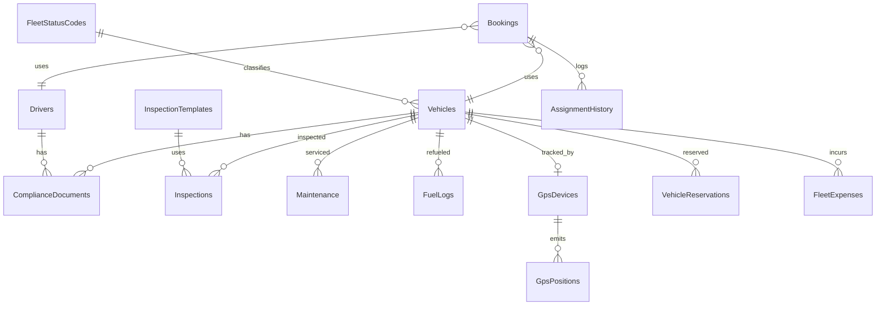

# Sheikh Travel ERP — Fleet Management System

## Phase 4: Database Design

| Field | Value |
|-------|-------|
| **Product** | Sheikh Travel ERP — Fleet Management |
| **Document** | Phase 4 — Database Design |
| **Version** | 1.0 |
| **Date** | June 2026 |
| **Database** | Azure SQL (multi-tenant, shared schema) |
| **Access** | Dapper + idempotent SQL migrations |

---

## Table of Contents

1. [Design Principle: Extend, Don't Duplicate](#1-design-principle-extend-dont-duplicate)
2. [Multi-Tenant Strategy](#2-multi-tenant-strategy)
3. [Conceptual to Physical Mapping](#3-conceptual-to-physical-mapping)
4. [Master Table Extensions](#4-master-table-extensions)
5. [Transaction Tables](#5-transaction-tables)
6. [Compliance & Inspection Tables](#6-compliance--inspection-tables)
7. [Status Master](#7-status-master)
8. [GPS & Tracking Tables](#8-gps--tracking-tables)
9. [ER Diagram](#9-er-diagram)
10. [Indexing & Azure SQL Performance](#10-indexing--azure-sql-performance)
11. [File Storage](#11-file-storage)
12. [Future AI Support](#12-future-ai-support)
13. [Build Order](#13-build-order)

---

## 1. Design Principle: Extend, Don't Duplicate

The codebase already has operational tables with live data and Dapper handlers. Rather than creating parallel `Fleet*` master tables (which would break every existing controller), the fleet model **extends** the current tables additively and **creates** only genuinely new transaction tables.

All migration statements are idempotent (`IF NOT EXISTS` guards) so they are safe to re-run on every startup, matching the existing migration convention.

---

## 2. Multi-Tenant Strategy

Shared-schema multi-tenancy. Every row is scoped by `TenantId`, and queries filter by the current tenant via `ITenantContext`.

| Column | Scope | Status |
|--------|-------|--------|
| `TenantId` | Tenant isolation | Exists on operational tables |
| `BranchId` | Branch within tenant | Added to `Vehicles`, `Drivers`, `Maintenance`, `FleetExpenses` |
| `DepartmentId` | Department within branch | Added to `Vehicles`, `Drivers` |

---

## 3. Conceptual to Physical Mapping

| Conceptual (Phase 4 draft) | Physical table | Strategy |
|----------------------------|----------------|----------|
| FleetVehicle | `Vehicles` | Extend columns |
| FleetDriver | `Drivers` | Extend columns |
| FleetGPSDevice | `GpsDevices` | Keep / extend |
| FleetAssignment | `Bookings` + `AssignmentHistory` | Bookings = trips; new audit history |
| FleetMaintenance | `Maintenance` | Extend columns |
| FleetFuelLog | `FuelLogs` | Keep as-is |
| FleetInspection | `Inspections` | **Create** |
| FleetCompliance | `ComplianceDocuments` | **Create** |
| FleetDocument | `VehicleDocuments` | Keep / extend |
| FleetExpense | `FleetExpenses` | **Create** |
| FleetGPSLog | `GpsPositions` | Keep; add index/partition |
| FleetGPSAlert | `GpsAlertEvents` | Keep |
| FleetNotification | `Notifications` | Shared ERP table |
| FleetAuditLog | `AuditLogs` | Shared ERP table |
| Status master | `FleetStatusCodes` | **Create** |

---

## 4. Master Table Extensions

### 4.1 Vehicles (added columns)

```sql
ALTER TABLE Vehicles ADD VehicleCode NVARCHAR(40) NULL;
ALTER TABLE Vehicles ADD VIN NVARCHAR(64) NULL;
ALTER TABLE Vehicles ADD Make NVARCHAR(100) NULL;
ALTER TABLE Vehicles ADD Color NVARCHAR(40) NULL;
ALTER TABLE Vehicles ADD VehicleType NVARCHAR(60) NULL;
ALTER TABLE Vehicles ADD EngineNo NVARCHAR(80) NULL;
ALTER TABLE Vehicles ADD ChassisNo NVARCHAR(80) NULL;
ALTER TABLE Vehicles ADD GpsDeviceId INT NULL;
ALTER TABLE Vehicles ADD PurchaseDate DATETIME2 NULL;
ALTER TABLE Vehicles ADD PurchasePrice DECIMAL(18,2) NULL;
ALTER TABLE Vehicles ADD BranchId INT NULL;
ALTER TABLE Vehicles ADD DepartmentId INT NULL;
```

`VehicleStatus` lifecycle (status master `FleetStatusCodes`, category `Vehicle`):

```
New → Available → Assigned → OnTrip → Available
                     ↓
                Maintenance / Reserved → Available
                     ↓
                  Retired
```

### 4.2 Drivers (added columns)

```sql
ALTER TABLE Drivers ADD DriverCode NVARCHAR(40) NULL;
ALTER TABLE Drivers ADD Nationality NVARCHAR(80) NULL;
ALTER TABLE Drivers ADD Email NVARCHAR(200) NULL;
ALTER TABLE Drivers ADD HireDate DATETIME2 NULL;
ALTER TABLE Drivers ADD PhotoUrl NVARCHAR(500) NULL;
ALTER TABLE Drivers ADD VerificationStatus NVARCHAR(30) NOT NULL DEFAULT N'Pending';
ALTER TABLE Drivers ADD BranchId INT NULL;
ALTER TABLE Drivers ADD DepartmentId INT NULL;
```

The existing `FullName` column is retained for backward compatibility; `FirstName`/`LastName` are derived in the application layer where needed rather than splitting the column destructively.

### 4.3 Maintenance (added columns)

```sql
ALTER TABLE Maintenance ADD MaintenanceType NVARCHAR(60) NULL;
ALTER TABLE Maintenance ADD OdometerReading DECIMAL(12,2) NULL;
ALTER TABLE Maintenance ADD NextDueMileage DECIMAL(12,2) NULL;
ALTER TABLE Maintenance ADD BranchId INT NULL;
```

---

## 5. Transaction Tables

### 5.1 AssignmentHistory

Audit trail of vehicle/driver assignments (the live trip lives in `Bookings`).

```sql
CREATE TABLE AssignmentHistory (
    Id INT IDENTITY(1,1) PRIMARY KEY,
    TenantId INT NULL,
    VehicleId INT NOT NULL,
    DriverId INT NULL,
    BookingId INT NULL,
    AssignmentType NVARCHAR(30) NOT NULL DEFAULT N'Trip',
    Status NVARCHAR(30) NOT NULL DEFAULT N'Active',
    StartAt DATETIME2 NOT NULL,
    EndAt DATETIME2 NULL,
    Notes NVARCHAR(500) NULL,
    CreatedAt DATETIME2 NOT NULL DEFAULT GETUTCDATE(),
    CreatedBy NVARCHAR(100) NULL,
    IsDeleted BIT NOT NULL DEFAULT 0
);
```

### 5.2 VehicleReservations

Holds a vehicle for a future window (blocks assignment overlap).

```sql
CREATE TABLE VehicleReservations (
    Id INT IDENTITY(1,1) PRIMARY KEY,
    TenantId INT NULL,
    VehicleId INT NOT NULL,
    DriverId INT NULL,
    ReservedFrom DATETIME2 NOT NULL,
    ReservedTo DATETIME2 NOT NULL,
    Reason NVARCHAR(300) NULL,
    Status NVARCHAR(30) NOT NULL DEFAULT N'Reserved',
    CreatedAt DATETIME2 NOT NULL DEFAULT GETUTCDATE(),
    CreatedBy NVARCHAR(100) NULL,
    IsDeleted BIT NOT NULL DEFAULT 0
);
```

### 5.3 FleetExpenses

General fleet expense ledger (tolls, fines, parking, misc) beyond fuel/maintenance.

```sql
CREATE TABLE FleetExpenses (
    Id INT IDENTITY(1,1) PRIMARY KEY,
    TenantId INT NULL,
    VehicleId INT NULL,
    DriverId INT NULL,
    Category NVARCHAR(60) NOT NULL,
    Amount DECIMAL(18,2) NOT NULL,
    Currency NVARCHAR(10) NOT NULL DEFAULT N'AED',
    ExpenseDate DATETIME2 NOT NULL,
    Description NVARCHAR(500) NULL,
    ReceiptUrl NVARCHAR(500) NULL,
    BranchId INT NULL,
    CreatedAt DATETIME2 NOT NULL DEFAULT GETUTCDATE(),
    CreatedBy NVARCHAR(100) NULL,
    IsDeleted BIT NOT NULL DEFAULT 0
);
```

---

## 6. Compliance & Inspection Tables

### 6.1 ComplianceDocuments

Replaces the single `Vehicles.InsuranceExpiryDate` column with a flexible, multi-document model covering both vehicles and drivers.

```sql
CREATE TABLE ComplianceDocuments (
    Id INT IDENTITY(1,1) PRIMARY KEY,
    TenantId INT NULL,
    EntityType NVARCHAR(20) NOT NULL,        -- Vehicle | Driver
    EntityId INT NOT NULL,
    DocumentType NVARCHAR(60) NOT NULL,      -- Insurance | Registration | License | Permit
    DocumentNumber NVARCHAR(100) NULL,
    IssuedDate DATETIME2 NULL,
    ExpiryDate DATETIME2 NULL,
    Status NVARCHAR(30) NOT NULL DEFAULT N'Valid',  -- Valid | Expiring | Expired
    FileUrl NVARCHAR(500) NULL,
    Notes NVARCHAR(500) NULL,
    CreatedAt DATETIME2 NOT NULL DEFAULT GETUTCDATE(),
    UpdatedAt DATETIME2 NULL,
    CreatedBy NVARCHAR(100) NULL,
    UpdatedBy NVARCHAR(100) NULL,
    IsDeleted BIT NOT NULL DEFAULT 0
);
```

### 6.2 InspectionTemplates

```sql
CREATE TABLE InspectionTemplates (
    Id INT IDENTITY(1,1) PRIMARY KEY,
    TenantId INT NULL,
    Name NVARCHAR(150) NOT NULL,
    Description NVARCHAR(500) NULL,
    ChecklistJson NVARCHAR(MAX) NOT NULL,    -- [{key,label,required}]
    IsActive BIT NOT NULL DEFAULT 1,
    CreatedAt DATETIME2 NOT NULL DEFAULT GETUTCDATE(),
    IsDeleted BIT NOT NULL DEFAULT 0
);
```

### 6.3 Inspections

```sql
CREATE TABLE Inspections (
    Id INT IDENTITY(1,1) PRIMARY KEY,
    TenantId INT NULL,
    VehicleId INT NOT NULL,
    TemplateId INT NULL,
    DriverId INT NULL,
    InspectedBy NVARCHAR(150) NULL,
    InspectionDate DATETIME2 NOT NULL DEFAULT GETUTCDATE(),
    OdometerReading DECIMAL(12,2) NULL,
    Result NVARCHAR(20) NOT NULL DEFAULT N'Pass',  -- Pass | Warning | Fail
    ResultsJson NVARCHAR(MAX) NULL,                 -- [{key,status,comment}]
    PhotosJson NVARCHAR(MAX) NULL,                  -- [blob urls]
    Comments NVARCHAR(1000) NULL,
    CreatedAt DATETIME2 NOT NULL DEFAULT GETUTCDATE(),
    CreatedBy NVARCHAR(100) NULL,
    IsDeleted BIT NOT NULL DEFAULT 0
);
```

---

## 7. Status Master

Status labels are seeded into a reference table so the UI does not hardcode enum values; the application still maps these to C# enums.

```sql
CREATE TABLE FleetStatusCodes (
    Id INT IDENTITY(1,1) PRIMARY KEY,
    Category NVARCHAR(30) NOT NULL,   -- Vehicle | Driver | Maintenance
    Code NVARCHAR(30) NOT NULL,
    Label NVARCHAR(100) NOT NULL,
    ColorToken NVARCHAR(30) NULL,     -- success | warning | danger | primary | muted
    SortOrder INT NOT NULL DEFAULT 0,
    IsActive BIT NOT NULL DEFAULT 1,
    CONSTRAINT UQ_FleetStatusCodes_Category_Code UNIQUE (Category, Code)
);
```

Seeded values map directly to the design-system `ColorToken` used by `fleet-status-badge`.

---

## 8. GPS & Tracking Tables

`GpsPositions` is the high-volume table (the conceptual `FleetGPSLog`). It is retained as-is from the GPS module with an additional covering index.

```sql
CREATE INDEX IX_GpsPositions_Vehicle_Recorded_Desc
    ON GpsPositions (VehicleId, RecordedAt DESC);
```

- Retention is handled by the existing `GpsSchemaMigration.ApplyRetentionAsync`.
- **Phase 4b (future):** monthly partitions `GpsPositions_YYYY_MM` once row counts exceed the partition threshold.

---

## 9. ER Diagram



---

## 10. Indexing & Azure SQL Performance

| Table | Index | Purpose |
|-------|-------|---------|
| `GpsPositions` | `(VehicleId, RecordedAt DESC)` | Latest position / history queries |
| `AssignmentHistory` | `(VehicleId, StartAt DESC)`, `(DriverId, StartAt DESC)` | Per-vehicle / per-driver timelines |
| `ComplianceDocuments` | `(EntityType, EntityId)`, `(ExpiryDate)` | Entity lookup + expiry scans |
| `Inspections` | `(VehicleId, InspectionDate DESC)` | Inspection history |
| `FleetExpenses` | `(VehicleId, ExpenseDate DESC)` | Expense reporting |

Filtered indexes use `WHERE IsDeleted = 0` to keep them lean, matching the GPS module convention.

---

## 11. File Storage

No binary content is stored in SQL. Tables store URLs only:

- `ComplianceDocuments.FileUrl`
- `Inspections.PhotosJson` (array of blob URLs)
- `FleetExpenses.ReceiptUrl`
- `VehicleDocuments.FileUrl`

Azure Blob path convention: `{tenantId}/{entityType}/{entityId}/{filename}`, configured via Settings → File Management.

---

## 12. Future AI Support

The JSON columns (`Inspections.ResultsJson`, `InspectionTemplates.ChecklistJson`) and URL-based document storage leave room for later AI features (OCR document extraction into `ComplianceDocuments`, inspection photo analysis) without further schema changes. An optional `FleetDashboardCache` JSON table can be added later for precomputed analytics.

---

## 13. Build Order

| Week | Tables | Migration file |
|------|--------|----------------|
| 1 | Extend `Vehicles`, `Drivers`, `Maintenance`; `FleetStatusCodes` | `FleetSchemaMigration.cs` |
| 2 | `AssignmentHistory`, `VehicleReservations`, `FleetExpenses` | `FleetSchemaMigration.cs` |
| 3 | `ComplianceDocuments`, `InspectionTemplates`, `Inspections` | `FleetComplianceMigration.cs` |
| 4 | `GpsPositions` covering index; future partition prep | `FleetSchemaMigration.cs` |

Both migrations are registered in [Program.cs](../SheikhTravelSystem.API/Program.cs) after `SubscriptionBillingMigration`:

```csharp
await FleetSchemaMigration.ApplyAsync(dbFactory, logger);
await FleetComplianceMigration.ApplyAsync(dbFactory, logger);
```

---

## Document Control

| Version | Date | Author | Changes |
|---------|------|--------|---------|
| 1.0 | June 2026 | Database Design | Initial Phase 4 database document |

**Related:** [11-fleet-phase-2-system-analysis.md](./11-fleet-phase-2-system-analysis.md), [12-fleet-phase-3-system-design.md](./12-fleet-phase-3-system-design.md), [13-fleet-phase-3-ui-ux-design.md](./13-fleet-phase-3-ui-ux-design.md)

---

*Sheikh Travel ERP — Fleet Management System — Phase 4 Database Design*
