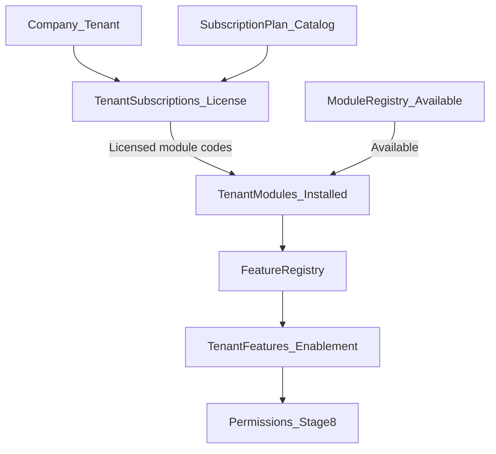
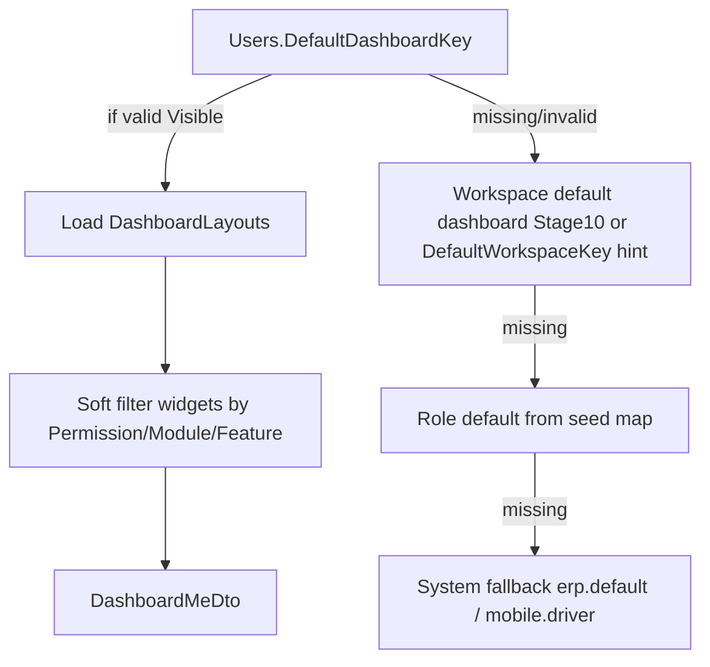
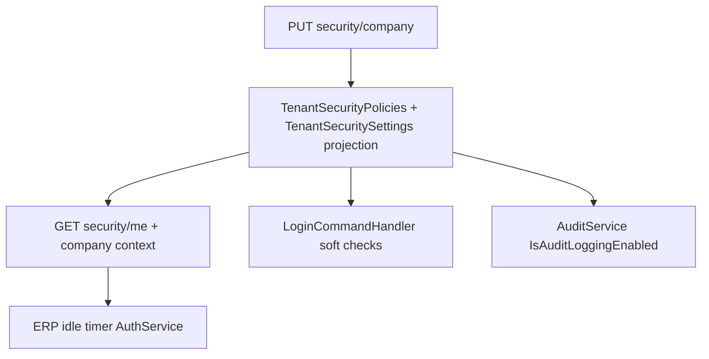
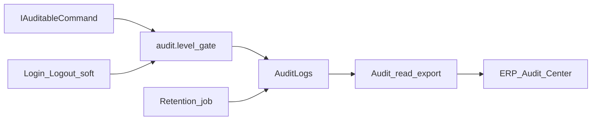

# Platform Administration Foundation

Living gap analysis for the 15-stage Platform Administration roadmap.

- Stage 1: shell + IA + nav + gates
- Stage 2: Company business model + thin Feature Registry
- Stage 3: Module Registry metadata on existing `Modules` / Module Management
- Stage 4: Subscription & License foundation
- Stage 5: Feature Management foundation
- Stage 6: User Management enhancement
- Stage 7: Role Management foundation
- Stage 8: Permission Management / Permission Engine
- Stage 9: Menu Builder foundation
- Stage 10: Workspace Builder foundation
- Stage 11: Dashboard Builder foundation
- Stage 12: Data Scope Engine foundation
- Stage 13: Security Center foundation
- Stage 14: Audit Center
- Stage 15: Backend Permission Enforcement
- Stage 16: GPS Device Control Center
## Role visibility

| Capability | Super Admin (`SUPER_ADMIN`) | Tenant Admin (`TENANT_ADMIN`) |
|------------|----------------------------|--------------------------------|
| Platform hub `/platform` | Yes (default home) | Yes if any platform permission |
| Companies (cross-tenant; permission `Platform.Tenants.*`) | Yes | No (`Platform.Tenants.*` excluded from template) |
| Organization (hierarchy / branches / departments) | Yes | Own tenant |
| Access Control hub + Users + Data Scope tab | Yes | Own tenant |
| Modules / Features / Subscriptions / Menus / Workspaces | Yes | View/manage own tenant via existing hubs (Menus: `Platform.Menus.Manage`; Workspaces: `Platform.Workspaces.Manage`) |
| Migrations | Yes (`Platform.Migrations.*`) | No |
| Database Reset / System Maintenance | Yes + Dev/Staging only (`Platform.System.Reset`) | No |
| Settings / Audit Logs | Yes | Own tenant (existing permissions) |

## Canonical route map (reuse, do not rebuild)

| Section | Canonical route | Existing surface |
|---------|-----------------|------------------|
| Hub | `/platform` | `platform-hub` |
| Company | `/platform/tenants` (alias `/platform/companies`) | `tenant-list` / provision / detail — UI says **Companies** |
| Organization | `/platform/organization-designer` | hierarchy feature |
| Branches / Departments | `/platform/branches`, `/platform/departments` | existing CRUD lists |
| Identity | `/platform/access-control` | Users / Roles / Permissions / Policies / Templates tabs |
| Users (standalone) | `/users` | users module — org assignment + profile metadata (Stage 6) |
| Modules | `/platform/module-management` | Module Registry UI (reuse; no new CRUD) |
| Features | `/platform/feature-management` | Feature Management (enable/disable only) |
| Menus | `/platform/menu-management` | Menu catalog CRUD (labels/visibility; not a page builder) |
| Workspaces | `/platform/workspace-management` | Workspace catalog + company enablement (not a page designer) |
| Subscriptions | `/platform/subscription-management` | license panels + existing billing |
| Security | `/platform/security-center` | **Stage 13** — policy registry + soft consume (Access Policies tab becomes deep-link / alias) |
| Permission Coverage | `/platform/permission-coverage` | **Stage 15** — read-only API inventory vs `RequirePermission` |
| Migrations | `/platform/migrations` | existing |
| System Maintenance | `/platform/maintenance` | database reset (label clarified) |
| Settings | `/settings` | settings module (Security category soft-delegates to Security Center) |
| Audit | `/platform/audit-center` | **Stage 14** — Audit Center (registry + AuditEvents); `/audit-logs` redirects |

### Stage 1 redirects / duplicates

| Legacy entry | Action |
|--------------|--------|
| `/platform` → `branches` | Replaced by hub |
| `/platform/roles` | Redirect → `/platform/access-control?tab=roles` |
| Local `organization-designer` component (unwired) | Leave unused; hierarchy feature is canonical |
| Nav label “Maintenance” under Platform | Renamed to **Database Reset** / System Maintenance |

### Stage 2 aliases

| Entry | Action |
|-------|--------|
| `/platform/companies` | Redirect → `/platform/tenants` |
| Company UI copy | Tenants → Companies (routes + `Platform.Tenants.*` codes unchanged) |
| `GET /api/platform/company/context` | Read-only company context (branding, branch/dept, modules, features, subscription) |
| Feature Registry | `FeatureDefinitions` + `TenantFeatures` metadata |

### Stage 3 Module Registry

| Entry | Action |
|-------|--------|
| `Modules` table | Metadata columns (category, version, status, capability flags, deps, …) |
| Catalog seed | Active enableable codes + Active bundled (non-enableable) capability rows + Coming Soon / Beta |
| `GET /api/platform/modules` | Enableable definitions (enriched) |
| `GET /api/platform/modules/catalog` | Full registry catalog |
| `GET /api/platform/modules/company` | Company installed + licensed (plan-allowed) |
| `GET /api/platform/modules/{codeOrId}` | Single registry entry |
| Module Management UI | Metadata display + filters; toggles only for Active enableable; bundled rows show “Included in {parent}” |
| Mobile | Company context `modules[]` parsed; read-only chips on profile / more |

### Stage 4 Subscription & License

| Entry | Action |
|-------|--------|
| `SubscriptionPlans` catalog | Starter / Pro / Enterprise seed; default module codes + quotas |
| `TenantSubscriptions` | Additive license fields (`SubscriptionCode`, storage, AI credits, GPS) |
| `GET /api/platform/subscriptions` (+ `/catalog`, `/company`) | Plan catalog + current company license |
| `GET /api/platform/license` (+ `/summary`) | Company license / compact summary |
| Semantics | **Available** = Module Registry Visible; **Installed** = `TenantModules`; **Licensed** = plan defaults |
| ERP | Subscription Management license/limits panels; company detail read-only strip |
| Mobile | Company context `subscription`; plan/expiry/modules/limits on profile / more |
| Explicit non-goals | Billing rebuild, gateways, runtime quota enforcement, feature flags |

### Stage 5 Feature Management

| Entry | Action |
|-------|--------|
| `FeatureDefinitions` | Extended metadata (category, status, icon, route, Mobile/AI/GPS, Visible) |
| `TenantFeatures` | Enablement + audit (`EnabledBy`, `EnabledDate`, `LastModified`); keep `IsEnabled` |
| `GET /api/platform/features` (+ `/catalog`, `/company`, `/{key}`) | Registry reads |
| `PUT /api/platform/features/company` | Enable/disable only (no CRUD) |
| Semantics | Features live under Modules; company toggles Active/Beta under installed modules |
| ERP | Feature Management page; company detail grouped read-only summary |
| Mobile | Enabled feature categories on profile / more |
| Consumes | Modules + Subscriptions / License |
| Produces | Company feature configuration |
| Feeds | Permissions, Menus, Workspaces, Dashboards (later stages) |
| Explicit non-goals | Runtime flags, A/B, canary, percentages, builders |



## Stage matrix (1–16)

| # | Stage | Status | Notes |
|---|-------|--------|-------|
| 1 | Platform Administration Foundation | **Done** | Hub, nav sync, ops permissions, child gates, gap doc |
| 1b | Platform Navigation Cleanup | **Done** | Administration no longer duplicates Platform Settings / Database Reset |
| 2 | Company Business Model | **Done** | Company vocabulary; Feature Registry; mobile context |
| 3 | Module Registry | **Done** | Metadata on `Modules`; catalog/company APIs; Module Management enrichment; mobile module list |
| 4 | Subscription & License | **Done (foundation)** | Plan catalog + license APIs; soft Licensed semantics; consumes Module Registry; hard enforcement deferred |
| 5 | Feature Management | **Done (foundation)** | Extends Feature Registry; company enablement; no runtime flags / builders |
| 6 | User Management | **Done (foundation)** | Org-aware Users; Branch/Department; lifecycle Status; workspace defaults metadata |
| 7 | Role Management | **Done (foundation)** | Business-role metadata; UserRoles assignment + soft scope; Access Control / Users UX |
| 8 | Permission Management | **Done (foundation)** | Catalog metadata; Permission Engine; effective permissions + Access Control Permissions tab |
| 9 | Menu Builder | **Done (foundation)** | Catalog metadata; manage APIs; Menu Management UX; soft FeatureKey gate on `menus/me` |
| 10 | Workspace Builder | **Done (foundation)** | Catalog + company enablement; resolve me/home; soft nav focus; ERP + mobile label |
| 11 | Dashboard Builder | **Done (foundation)** | Registry + layout APIs; ERP management; mobile consume + soft gates |
| 12 | Data Scope Engine | **Done (foundation)** | ScopeLevel + engine; pilot Vehicles/Drivers/GPS/fleet reports; soft scopes |
| 13 | Security Center | **Done (foundation)** | Policy registry + soft enforce; Security Center UX; mobile safe summary |
| 14 | Audit Center | **Done (foundation)** | Registry + AuditEvents + engine; ERP explorer; mobile summary |
| 15 | Backend Permission Enforcement | **Done (foundation)** | Catalog write codes; controller attrs; Data Scope expansion; audit markers; coverage page |
| 16 | GPS Device Control Center | **Done (foundation)** | Manufacturers/models/capabilities/commands/templates; translator; transports; simulator; EV26R seed |

## Foundation permissions (Stage 1)

| Code | Purpose |
|------|---------|
| `Platform.Migrations.View` | View schema migration status |
| `Platform.Migrations.Manage` | Apply pending migrations |
| `Platform.System.Reset` | Database reset (still Super Admin + Dev/Staging) |

### Navigation ownership (post Stage 15 cleanup)

| Menu | Canonical parent | Notes |
|------|------------------|-------|
| Settings | **Platform** | Retired from Administration |
| Database Reset | **Platform** | Retired from Administration |
| Notification Center | **Administration** | Operational tool, not Platform catalog |
| Users / Roles / Permissions | **Access Control** | Identity hub |

`PlatformNavigationCleanupMigration` deactivates Administration copies of Platform-owned routes. Live nav is driven by `GET /api/platform/menus/me` (DB), with `menu-config.ts` as API fallback only.

## Stage 2 deliverables

- **Persistence:** `Tenants` / `TenantId` unchanged; Company is product/API alias language (`companyId` / `companyName`).
- **Feature Registry:** Seeded catalog + per-company enablement rows; list endpoints (`/api/platform/features/*`).
- **ERP:** Companies copy in hub/list/menus; company detail Hierarchy/Capabilities strip + feature metadata list.
- **Mobile:** Read-only company context after login (profile / more / dashboard header). No company admin CRUD on Flutter.

## Stage 3 deliverables

- **Module Registry:** Metadata on existing `Modules` (no duplicate tables). Status: Active / Beta / Coming Soon / Deprecated / Disabled. Shipped capability rows (Drivers, Vehicles, Bookings, …) are **Active + non-enableable** (included in parent `TenantModuleCatalog` toggles such as Fleet/Travel); Coming Soon is reserved for unfinished product modules.
- **APIs:** Catalog, company, by-key read models; existing enable/disable PUT unchanged.
- **ERP:** Module Management shows category, version, dependencies, status, Mobile/AI/GPS, Installed/Licensed; bundled rows show Included-in chips.
- **Mobile:** Parses installed `modules[]`; display-only chips. No module admin.

## Stage 4 deliverables

- **Plan catalog:** `SubscriptionPlans` + `SubscriptionPlanCatalog` seed (Starter / Pro / Enterprise).
- **License metadata:** Additive columns on `TenantSubscriptions`; Licensed modules derived from plan defaults ∩ Available Active modules.
- **APIs:** Subscription catalog/company + license/summary; enriched subscription overview; company context nested `subscription`.
- **ERP:** License/limits on Subscription Management; read-only subscription strip on company detail.
- **Mobile:** Parse subscription from company context; display plan, expiry, licensed modules, storage/AI on profile / more.

## Stage 5 deliverables

- **Feature Registry upgrade:** Metadata on existing `FeatureDefinitions` (no duplicate tables). Categories: Fleet, Vehicles, Drivers, Maintenance, Fuel, GPS, Travel, Bookings, Trips, CRM, Finance, Reports, Administration, AI, …
- **Company enablement:** `TenantFeatures` with audit columns; `PUT /api/platform/features/company` enable/disable only.
- **APIs:** Catalog / company / by-key; company context returns enabled features with display metadata.
- **ERP:** Feature Management page (Commercial hub); company detail grouped ✓/✗ summary with deep-link.
- **Mobile:** Parse enriched features; enabled category chips on profile / more. No feature admin.
- **Still missing (later):** Runtime flags / A/B; Permission Engine (Stage 8); Menu / Workspace / Dashboard builders.

## Stage 6 deliverables

- **Users table:** Additive profile/lifecycle/workspace columns (`JobTitle`, `EmployeeCode`, `EmployeeType`, `Status`, workspace/dashboard keys, language/theme/avatar). `IsActive` remains the auth gate; `Status` syncs with it.
- **APIs:** Enriched `/api/Users` list/detail/create/update; filters for branch/department/status/employee type; `GET me` / `profile` / `company/summary`; self-service profile preferences.
- **Company context:** Nested `currentUser` (job title, workspace, theme, language, …); prefer stored workspace key over derived hint.
- **ERP:** Users list columns/filters; form org + metadata fields; Access Control Users tab Branch/Department/Status; company detail user summary strip.
- **Mobile:** Read-only Company / Branch / Department / Job Title / Workspace / Theme. No user admin.
- **Consumes:** Company, Modules, Features. **Produces:** Organization-aware users. **Feeds:** Role Management (Stage 7), Permission Engine (Stage 8).

## Stage 7 deliverables

- **Roles metadata:** Additive columns on `Roles` (`DisplayName`, `Description`, `Category`, `SortOrder`, `Visible`, `RoleType`) + `RoleRegistrySeed` for system roles.
- **UserRoles assignment:** Soft `BranchId` / `DepartmentId` scope + audit (`AssignedAt` / `AssignedBy`); no Data Scope enforcement.
- **APIs:** `GET/PUT /api/Users/{id}/roles`; `GET /api/platform/roles/company`; enriched role/templates DTOs; legacy `Users.Role` sync into `UserRoles` on create/update (without wiping extra business roles).
- **Company context:** `AssignedRoles[]` (code, displayName, category) for ERP/mobile display.
- **ERP:** Access Control Roles/Templates metadata + filters; Users form multi-role assignment; list role chips; company detail roles strip → Access Control.
- **Mobile:** Parse assigned roles; display chips on profile / More. No role admin.
- **Consumes:** Stage 6 Users. **Produces:** Company-aware role assignment + business-role metadata. **Feeds:** Permission Engine (Stage 8).
- **Non-goals:** Permission Engine, Data Scope Engine, template builder, ASP.NET Identity replacement, mobile role admin.

## Stage 8 deliverables

- **Permissions metadata:** Additive columns on `Permissions` (`DisplayName`, `Category`, `SortOrder`, `Visible`, `Action`, `ModuleKey`) + `PermissionRegistrySeed` from existing `*Permissions` catalogs.
- **Permission Engine:** `IPermissionEngine` resolves UserRoles → RolePermissions (template fallback) → soft intersect with installed modules / enabled features when mapped; unmapped permissions pass through. Super Admin = full catalog; Tenant Admin Platform.* bypass mirrored for effective lists.
- **APIs:** Enriched `GET /api/platform/permissions` (filters); `GET /api/platform/permissions/effective`; `GET /api/Users/{id}/permissions`; company context / profile `EffectivePermissions[]`.
- **Wiring:** `UserAccessService` delegates to engine (login/refresh JWT claims from engine result). Matrix write path unchanged.
- **ERP:** Access Control Permissions tab metadata + filters + “My effective” strip; company detail roles/permissions deep-links; Users form read-only effective categories.
- **Mobile:** Parse effective permissions; category chips on Profile / More. No permission admin.
- **Consumes:** Stage 7 roles. **Produces:** Effective permission evaluation + catalog metadata. **Feeds:** Menu Builder (9), Stage 15 enforcement expansion.
- **Non-goals:** JWT/MFA redesign, Data Scope, deny-lists, permission marketplace, Stage 15 blanket attributes, mobile permission admin.

## Stage 9 deliverables

- **Menu metadata:** Additive columns on `PlatformMenus` / `PlatformModules` + `MenuRegistrySeed` backfill; `MenuBuilderFoundationMigration`.
- **Runtime nav:** `GET /api/platform/menus/me` keeps Permission Engine + tenant modules; soft FeatureKey gate when tenant feature rows exist; respects `Visible` / `IsActive`; enriched display fields.
- **Manage APIs:** Catalog (`GET /menus`, `/menus/catalog`); PUT module/item; POST item under existing module; DELETE soft-deactivates. Gated by `Platform.Menus.Manage`.
- **Company context:** Compact `NavSummary` (module/item counts + top/mobile labels) derived from same filter logic as `menus/me`.
- **ERP:** `/platform/menu-management` (filters, edit drawer, create under module, deactivate); hub + nav + company detail strip; shell uses enriched `menus/me` labels; `menu-config.ts` fallback kept.
- **Mobile:** Parse `navSummary`; read-only chips on Profile / More. App chrome remains `fleet_nav_config.dart`. No menu admin.
- **Consumes:** Permission Engine + Modules + Features. **Produces:** Editable permission-aware nav catalog. **Feeds:** Workspace (10) / Dashboard (11).
- **Non-goals:** Visual/drag-drop page builder, per-tenant menu marketplace, nested ParentId tree UI, Workspace/Dashboard builders, mobile menu admin, JWT redesign, replacing Access Control matrix.

## Stage 10 deliverables

- **Persistence:** `WorkspaceDefinitions` + `TenantWorkspaces` (company enablement); `WorkspaceBuilderFoundationMigration` after Menu Builder.
- **Seed catalog:** `platform`, `company`, `fleet`, `drivers`, `trips`, `finance`, `driver`, `home` with display metadata, home routes, and soft `ModuleKeysJson`.
- **Permission:** `Platform.Workspaces.Manage` (SUPER_ADMIN / TENANT_ADMIN template); Platform nav item → `/platform/workspace-management`.
- **APIs:** `/api/platform/workspaces` catalog / company / me; PUT company enablement; Super-Admin create/update/deactivate definitions.
- **Resolver:** Prefer `Users.DefaultWorkspaceKey` when catalog-visible + company-enabled; else role hint; else `home`. Nested `Workspace` on company context; keep `workspaceHint` alias.
- **Soft nav focus:** `menus/me` soft-orders / soft-hides modules via resolved workspace `ModuleKeysJson` when non-empty.
- **ERP:** `/platform/workspace-management`; hub tile + `menu-config` fallback + company detail strip; Users form workspace select; login `getHomeRoute()` from resolved workspace.
- **Mobile:** Parse nested `workspace`; Profile / More label chips. No workspace admin.
- **Consumes:** Stage 6 user defaults + Stage 9 menus. **Produces:** Editable landing workspace catalog. **Feeds:** Dashboard Builder (11) via `DefaultDashboardKey` metadata.
- **Non-goals:** Visual/drag-drop page designer, replacing Menu Management, A/B/canary workspaces, Dashboard Builder UI, Data Scope Engine, mobile workspace admin, JWT/MFA changes.

## Stage 11 plan — Dashboard Builder (foundation)

> **Status:** Done (foundation). Runtime ERP `/dashboard` hosts remain fixed (optional Phase B soft host deferred). Matrix: registry + layout assignment live.
> **Depends on:** Stage 6 (`DefaultDashboardKey`), Stage 8 (Permission Engine), Stage 9 (menus/me soft gates), Stage 10 Workspace Builder (**done** — workspace→dashboard binding via `DefaultDashboardKey` metadata).
> **Route (ERP):** `/platform/dashboard-management` — catalog + layout compose; does **not** replace `/dashboard` runtime screens.

### Problem statement

Today dashboards are **hard-coded**:

| Surface | Today |
|---------|--------|
| ERP `/dashboard` | Role/feature switches fixed components (`default-dashboard`, fleet dashboard content, trip dashboard, …) |
| Flutter Fleet/Driver home | `dashboard_layout.dart` + `dashboard_layout_registry.dart` fixed widget lists per role |
| Users | `DefaultDashboardKey` column exists but is **not resolved** to a layout catalog |

Stage 11 introduces a **Dashboard Registry + company/user layout assignment** so operators can choose/order widgets from a seeded catalog — without a visual page designer.

### Semantics

| Term | Meaning |
|------|---------|
| **Dashboard Definition** | Catalog row: `DashboardKey`, display name, audience (ERP / Mobile / Both), default workspace key, status |
| **Widget Definition** | Catalog row: `WidgetKey` (stable code e.g. `fleetKpis`, `liveFleetCard`), category, permission/feature/module soft gates, platforms |
| **Dashboard Layout** | Ordered list of widget keys for a dashboard definition (company override optional later) |
| **Assigned dashboard** | User `DefaultDashboardKey` → definition; fallback: workspace default → role default → system `default` |
| **Available widget** | Visible + Active in registry **and** soft-pass Permission Engine / installed module / enabled feature (same soft style as menus) |

### Persistence (additive, no duplicate app dashboards)

| Table / column | Purpose |
|----------------|---------|
| `DashboardDefinitions` | Catalog of dashboards (`DashboardKey` PK/unique, `DisplayName`, `Description`, `Audience`, `DefaultWorkspaceKey`, `Category`, `SortOrder`, `Status`, `Visible`, `IsSystem`) |
| `DashboardWidgetDefinitions` | Widget catalog (`WidgetKey`, `DisplayName`, `Category`, `Icon`, `PermissionCode`, `FeatureKey`, `ModuleKey`, `SupportsErp`, `SupportsMobile`, `SortOrder`, `Status`, `Visible`) |
| `DashboardLayouts` | `(DashboardKey, WidgetKey, SortOrder, ColumnSpan?, IsVisible)` composition |
| `TenantDashboardOverrides` *(optional Phase B)* | Per-company layout override of a system dashboard |
| Existing `Users.DefaultDashboardKey` | Assignment target (already migrated Stage 6) |

Migration: `DashboardBuilderFoundationMigration` + seed from current Flutter `DashboardWidgetId` + ERP fleet/default widgets.

### Seed catalog (initial)

**Dashboards (system):**

| Key | Audience | Default workspace hint |
|-----|----------|------------------------|
| `erp.default` | ERP | `erp.ops` |
| `erp.fleet` | ERP | `erp.fleet` |
| `erp.trips` | ERP | `erp.trips` |
| `mobile.driver` | Mobile | `mobile.driver` |
| `mobile.fleet_ops` | Mobile | `mobile.fleet` |
| `mobile.admin` | Mobile | `mobile.admin` |

**Widgets:** map 1:1 from Flutter `DashboardWidgetId` + ERP fleet KPI/alerts/assignments cards (codes stable; UI still owns rendering).

### APIs

| Method | Path | Purpose |
|--------|------|---------|
| `GET` | `/api/platform/dashboards` | Tenant-filtered catalog (definitions) |
| `GET` | `/api/platform/dashboards/catalog` | Full registry (incl. Coming Soon widgets) |
| `GET` | `/api/platform/dashboards/{key}` | Definition + ordered layout widgets |
| `GET` | `/api/platform/dashboards/me` | Resolved layout for current user (assignment + soft gates) |
| `GET` | `/api/platform/dashboards/widgets` | Widget catalog |
| `PUT` | `/api/platform/dashboards/{key}/layout` | Reorder / show-hide widgets (manage) |
| `PUT` | `/api/platform/dashboards/{key}` | Update definition metadata (not create arbitrary keys in v1) |
| `POST` | `/api/platform/dashboards` *(optional Phase B)* | Clone system dashboard for company |

**Permissions:**

| Code | Purpose |
|------|---------|
| `Platform.Dashboards.View` | View catalog / company layouts |
| `Platform.Dashboards.Manage` | Edit layout order/visibility + metadata |

Gate like Menus: Super Admin + Tenant Admin with permission; no mobile admin.

**Company context enrichment:**

```json
"dashboard": {
  "key": "mobile.fleet_ops",
  "displayName": "Fleet operations",
  "widgetKeys": ["greeting", "fleetKpis", "liveFleetCard", "aiAttention", "quickActions"]
}
```

### Resolution order (`/dashboards/me`)



### ERP deliverables

- **`/platform/dashboard-management`:** list definitions; filter by audience/status; edit drawer (label, description, workspace hint); layout editor = ordered checklist / up-down (not drag canvas); widget metadata read-only.
- **Platform hub card** + company detail strip: current default dashboards counts → deep-link.
- **Runtime `/dashboard`:** keep existing screens; optional Phase B: if `dashboards/me` returns keys, prefer registered widget host for fleet/default only — **do not** rewrite all dashboards in Stage 11 foundation.
- **Users form:** dropdown of Visible dashboard keys for `DefaultDashboardKey` (already field; wire to catalog).

### Mobile deliverables

- Parse `dashboard` / `dashboards/me` widget key list.
- `dashboard_layout_registry.dart`: if API keys present, **filter/reorder** existing widgets; unknown keys skipped.
- Profile / More: read-only “Dashboard: {displayName}” chip.
- **No** dashboard admin UI on Flutter.

### Consumes / Produces / Feeds

| | |
|--|--|
| **Consumes** | Users (`DefaultDashboardKey`), Permission Engine, Modules, Features, Menus (nav), Workspace keys (Stage 10 when ready) |
| **Produces** | Dashboard + widget registry; resolved `/dashboards/me` layout |
| **Feeds** | Stage 12 Data Scope (widget data filtering), Stage 13 Security Center (dashboard access policy), Stage 15 enforcement |

### Explicit non-goals (Stage 11)

- Visual drag-drop / WYSIWYG page builder or widget marketplace
- Custom SQL / BI query widgets / Looker embeds
- Per-user free-form layouts (assignment is catalog key only in v1)
- Runtime A/B dashboard experiments
- Replacing ERP fleet/trip dashboard component implementations wholesale
- Mobile dashboard admin CRUD
- Hard fail when widget permission missing (soft hide, same as menus)

### Implementation slices

| Slice | Work | Exit criteria |
|-------|------|----------------|
| **11.1 Schema + seed** | Migration + Dashboard/Widget/Layout seed from current Flutter + ERP widgets | Migration applies; catalog rows present |
| **11.2 Read APIs** | Catalog / by-key / widgets / `me` resolution + company context | `dashboards/me` returns gated widget keys for Admin + Driver |
| **11.3 Manage APIs + ERP page** | PUT layout/metadata; `/platform/dashboard-management`; hub + Users dropdown | Tenant Admin can reorder visible widgets on a system dashboard |
| **11.4 Mobile consume** | Parse layout; registry filter/reorder; profile chip | Driver/Fleet home honors API order without code change for known widgets |
| **11.5 Soft ERP host (optional)** | Fleet/default dashboard hosts registered widget subset | Feature-flagged; fallback to fixed UI if API empty |

### Test plan

- [ ] Super Admin sees full catalog; Tenant Admin only own-tenant manage
- [ ] User with `DefaultDashboardKey=mobile.fleet_ops` gets that layout on `me`
- [ ] Invalid/missing key falls back to workspace → role → system default
- [ ] Widget with missing permission/feature is omitted (soft), not 403 on whole dashboard
- [ ] Layout PUT rejects unknown widget keys; preserves IsSystem definitions
- [ ] Flutter: API order changes widget sequence; unknown key ignored
- [ ] Company context includes compact dashboard summary
- [ ] No regression: ERP `/dashboard` and Flutter home still render when API empty (offline/fallback)

### Handoff from Stage 10 (Workspace Builder)

Stage 10 exposes **workspace → default dashboard key** (`WorkspaceDefinitions.DefaultDashboardKey` + resolved company-context `Workspace`) so Stage 11 resolution can prefer workspace defaults over role seed maps.

### Handoff to Stage 12

Stage 12 **Data Scope Engine** filters **data inside** dashboard widgets (branch/department/fleet scope). Stage 11 only decides **which widgets appear**, not row-level data.

## Stage 12 deliverables

- **Roles.ScopeLevel:** Additive metadata (`Company` / `Branch` / `Department` / `Assigned`) via `DataScopeFoundationMigration`; backfill Super/Tenant Admin → Company, fleet ops roles → Branch.
- **Data Scope Engine:** `IDataScopeEngine` + `DataScopeResolver` resolve Users home org ∪ UserRoles soft scopes; Super/Tenant Admin company-wide; unscoped legacy soft pass-through.
- **APIs:** `GET /api/platform/data-scope/me`; `GET /api/Users/{id}/data-scope`; company context nested `dataScope` (mode, ids, labels, source).
- **Pilot enforcement:** Vehicles / Drivers / GPS fleet trips + fleet fuel/vehicle reports intersect optional filters with effective scope (`DataScopeSql`). Travel bookings/trips deferred.
- **ERP:** Access Control **Data Scope** tab (my effective scope); Users form read-only effective chips; company detail deep-link. Role scope writes remain Stage 7 Users UX. Not folded into Access Policies.
- **Mobile:** Parse `dataScope`; chips on Profile / More. No scope admin; server remains source of truth.
- **Consumes:** Stage 6 Users org, Stage 7 soft scopes, Stage 8 permissions, tenant isolation.
- **Produces:** Effective data scope + pilot fleet enforcement.
- **Feeds:** Stage 11 widget payloads (row filter), Stage 13 (orthogonal), Stage 15 broader query coverage.
- **Non-goals:** ABAC/deny-lists, Access Policies rewrite, travel schema rewrite, JWT redesign, mobile scope admin, visual policy designer.

## Stage 13 — Security Center (foundation) — **Done**

> **Status:** **Done (foundation).** Policy registry + tenant values + Security Engine soft enforcement; dual-write to `TenantSecuritySettings`.
> **Depends on:** Stage 8 Permission Engine (gates), Stage 12 Data Scope foundation (**done** — Security Center does not own row scope).
> **Route (ERP):** `/platform/security-center` — company security policy hub; Access Control `?tab=policies` redirects / deep-links here; Settings → Security soft-delegates (JWT TTL only; policies in Security Center).
> **Does not replace:** Audit Center UI (`/audit-logs`, Stage 14), JWT secret/issuer architecture, Identity / MFA product, Permission Engine, Data Scope Engine.

### Deliverables

- **Schema:** `SecurityPolicyDefinitions` + `TenantSecurityPolicies`; Users `FailedLoginAttempts` / `LockoutEndUtc` / `PasswordChangedAt`.
- **Engine + APIs:** `ISecurityEngine`; `/api/platform/security` catalog/company/me; legacy tenants/{id}/security façade + dual-write.
- **Soft enforce:** login lockout + soft IP allowlist + password age; password min/complexity on change; `audit.level` gate; ERP idle/absolute timeout from `security/me`.
- **ERP:** Security Center page; hub + nav; Access Policies deep-link; Settings Security pointer.
- **Mobile:** company-context safe `security` summary chips (no IP/complexity). No admin.

### Problem statement (historical)

Security flags were **stored but largely dead**:

| Surface | Today |
|---------|--------|
| Access Control → Policies | Edit MFA / password expiry / session timeout / GDPR / audit / VAT for selected tenant |
| Settings → Security | Same six keys persisted; UI also shows lockout, OTP, JWT, IP lists that are **dropped on save** |
| Stub cards | IP whitelist, working hours — “Soon”, not wired |
| Login / session | BCrypt + JWT + refresh; **no** MFA challenge, lockout, password-age gate, idle logout, IP check |
| Audit write path | Always writes; ignores `IsAuditLoggingEnabled` |
| Platform hub | No Security Center tile |

Stage 13 introduces a **Security Policy Registry + company policy values + soft consume** so operators manage one coherent policy catalog and ERP honors at least session timeout / audit toggle / password-age soft checks — without an IAM rewrite.

### Semantics

| Term | Meaning |
|------|---------|
| **Security Policy Definition** | Catalog row: stable `PolicyKey`, display name, category (Authentication / Session / Network / Compliance), value type (bool / int / string / string-list), default, min/max, status |
| **Company Security Policy** | Per-tenant value for a policy key (extends / replaces flat `TenantSecuritySettings` columns) |
| **Effective security summary** | Resolved company values + appsettings JWT fallbacks for token TTLs when tenant override absent |
| **Soft consume** | Login / ERP / AuditService read effective summary; warn or soft-block; **no** full MFA challenge product in foundation |
| **Hard consume (deferred)** | TOTP/OTP challenge, hard IP firewall, working-hours deny, forced password rotate UX |

### Persistence (additive)

| Table / column | Purpose |
|----------------|---------|
| `SecurityPolicyDefinitions` | Catalog (`PolicyKey` unique, `DisplayName`, `Description`, `Category`, `ValueType`, `DefaultValueJson`, `MinValue`, `MaxValue`, `SortOrder`, `Status`, `Visible`, `IsSystem`) |
| `TenantSecurityPolicies` | `(TenantId, PolicyKey, ValueJson, UpdatedAt, UpdatedBy)` company overrides |
| Existing `TenantSecuritySettings` | **Keep** as compatibility projection of core keys during foundation; dual-write from Security Center PUT; Settings adapter reads/writes via same projection |
| Optional additive columns on `TenantSecuritySettings` | `MaxLoginAttempts`, `AccountLockoutMinutes`, `IpWhitelistJson`, `BlockedIpsJson`, `JwtExpiryMinutes`, `RefreshTokenExpiryDays` — if dual-write preferred over JSON store for hot paths |

Migration: `SecurityCenterFoundationMigration` + `SecurityPolicyRegistrySeed` from current Access Policies + Settings Security schema keys.

**Seed policy keys (initial):**

| PolicyKey | Category | Type | Soft consume in Stage 13 |
|-----------|----------|------|---------------------------|
| `auth.mfa_required` | Authentication | bool | Expose on company context / login summary; **no** challenge UI yet (flag + banner only) |
| `auth.otp_on_login` | Authentication | bool | Catalog + store only (Coming Soon enforce) |
| `auth.password_expiry_days` | Authentication | int | Soft warn / soft-block login when `Users` password age exceeds (if `PasswordChangedAt` exists or use `CreatedAt` fallback) |
| `auth.max_login_attempts` | Authentication | int | Soft lockout counter on `Users` (additive columns) when &gt; 0 |
| `auth.lockout_minutes` | Authentication | int | Soft lockout window |
| `session.timeout_minutes` | Session | int | ERP idle logout when &gt; 0 |
| `session.jwt_expiry_minutes` | Session | int | Soft override on token issue when set (else appsettings) |
| `session.refresh_expiry_days` | Session | int | Soft override on refresh token issue when set |
| `network.ip_whitelist` | Network | string-list | Soft allow-check on login when non-empty (Coming Soon → soft in 13.4 if cheap) |
| `network.ip_blocklist` | Network | string-list | Soft deny on login when match |
| `compliance.gdpr_enabled` | Compliance | bool | Company context flag only |
| `compliance.audit_logging_enabled` | Compliance | bool | `AuditService` respects flag (skip write when false) |
| `compliance.vat_enabled` | Compliance | bool | Company context / finance hint only |

### APIs

| Method | Path | Purpose |
|--------|------|---------|
| `GET` | `/api/platform/security/policies` | Tenant-filtered effective policies (definitions + values) |
| `GET` | `/api/platform/security/policies/catalog` | Full registry (incl. Coming Soon) |
| `GET` | `/api/platform/security/company` | Current company effective summary DTO |
| `GET` | `/api/platform/security/me` | Compact summary for session (timeout, MFA required, password expired?) |
| `PUT` | `/api/platform/security/company` | Upsert policy values (manage) |
| `GET/PUT` | `/api/platform/tenants/{id}/security` | **Keep** as compatibility façade mapping to core keys |

**Permissions:**

| Code | Purpose |
|------|---------|
| `Platform.Security.View` | View Security Center / company policies |
| `Platform.Security.Manage` | Edit company security policies |

Gate: Super Admin + Tenant Admin with permission (own tenant only for Tenant Admin). Reuse existing tenant security PUT authorization patterns.

**Company context enrichment:**

```json
"security": {
  "mfaRequired": false,
  "sessionTimeoutMinutes": 30,
  "passwordExpiryDays": 90,
  "auditLoggingEnabled": true,
  "passwordExpired": false
}
```

### Soft consume (foundation)



| Consumer | Behavior |
|----------|----------|
| ERP `AuthService` | If `sessionTimeoutMinutes` &gt; 0, idle → logout / refresh fail UX |
| `LoginCommandHandler` | Soft: lockout when attempts exceeded; soft-block or warning when password expired; optional IP soft-check |
| `JwtTokenService` / login issue | Prefer tenant JWT/refresh TTLs when policy set |
| `AuditService` | Skip insert when `audit_logging_enabled` is false |
| Mobile | Parse `security` chip (MFA/session); **no** admin; idle optional later |

### ERP deliverables

- **`/platform/security-center`:** policy list by category; edit drawer / inline toggles + numbers + textarea for IP lists; status badges (Enforced soft / Stored only / Coming Soon).
- **Platform hub** Identity/Security card → Security Center.
- **Access Control Policies tab:** redirect or embed link to Security Center (avoid two editors drifting).
- **Settings → Security:** keep UX; adapter dual-writes through Security Center APIs / projection so keys no longer drop silently (lockout/IP/JWT persist).
- **Company detail strip:** MFA / session / audit flags → deep-link.
- **Nav:** `menu-config` + PlatformMenus seed item `Platform.Security.View`.

### Mobile deliverables

- Parse company-context `security` summary.
- Profile / More: read-only chips (e.g. “MFA required”, “Session 30m”).
- **No** security admin CRUD on Flutter.

### Consumes / Produces / Feeds

| | |
|--|--|
| **Consumes** | Permission Engine (manage gates), Company/Tenant context, Stage 12 Data Scope (**orthogonal** — do not mix branch scope into Security Center) |
| **Produces** | Security policy registry; effective `/security/me` + company `security` summary; soft session / login / audit consume |
| **Feeds** | Stage 14 Audit Center (security events taxonomy / deep-link), Stage 15 enforcement (authz remains separate from authn policy) |

### Explicit non-goals (Stage 13)

- Full MFA/TOTP/OTP challenge product, SMS/email OTP providers, recovery codes UI
- SSO / SAML / OIDC / ASP.NET Identity replacement
- Hard network firewall / WAF / geo-blocking product
- Working-hours access deny as v1 hard gate
- Replacing Audit Center list/filter/export (Stage 14)
- Changing global JWT signing secret / issuer design
- Mobile security admin CRUD
- Data Scope / Permission Engine redesign
- (Stage 15 foundation complete separately — see Stage 15 section)

### Implementation slices

| Slice | Work | Exit criteria |
|-------|------|----------------|
| **13.1 Schema + seed** | `SecurityCenterFoundationMigration` + policy catalog seed; optional additive lockout/IP/JWT columns; dual-write projection helpers | Migration applies; catalog rows present; legacy GET/PUT security still works |
| **13.2 Read/Manage APIs** | Catalog / company / me / PUT company; permissions; company context `security` | Tenant Admin can read/write own policies; Super Admin any tenant |
| **13.3 ERP Security Center** | `/platform/security-center`; hub + nav + company strip; Access Policies → redirect/deep-link; Settings adapter persists full schema keys | One coherent editor; Settings no longer drops lockout/IP/JWT |
| **13.4 Soft consume** | ERP idle timeout; AuditService flag; login soft lockout + password-age; optional IP soft-check; JWT/refresh soft TTL | At least session idle + audit flag + one login soft-check verified |
| **13.5 Mobile consume** | Parse `security`; Profile/More chips | Display-only; no admin |

### Test plan

- [ ] Super Admin sees catalog + can edit any company; Tenant Admin only own tenant
- [ ] PUT company policy updates both registry store and `TenantSecuritySettings` projection for core keys
- [ ] Settings → Security save persists lockout / IP / JWT keys (no silent drop)
- [ ] Access Policies tab does not diverge (redirect or shared API)
- [ ] ERP idle logout fires when `session.timeout_minutes` &gt; 0
- [ ] `IsAuditLoggingEnabled=false` skips new audit rows
- [ ] Login soft-lockout after `max_login_attempts`; clears after `lockout_minutes`
- [ ] Password expiry soft-block/warn when days exceeded
- [ ] Company context includes compact `security` summary
- [ ] Mobile chips render; no security admin routes
- [ ] No regression: login/refresh still work when policies empty / defaults

### Handoff from Stage 12 (Data Scope)

Stage 12 clamps **which rows** a user sees. Stage 13 clamps **how users authenticate / stay signed in / whether audits write**. Do not put `ScopeLevel` or branch filters into Security Center.

---

## Stage 14 — Audit Center (foundation) — **Done**

> **Status:** **Done (foundation).** Registry `AuditEventDefinitions` + store `AuditEvents` via `IAuditEngine`; dual-write legacy `AuditLogs`; Stage 13 `audit.level` / `audit.login_events` gate writes.
> **Route (ERP):** `/platform/audit-center` (canonical); `/audit-logs` redirects. Security Center deep-links security events.
> **Consumes:** Stage 13 Security Center policies.
> **Produces:** Centralized audit events + company `audit` summary.
> **Feeds:** Stage 15 Backend Enforcement (orthogonal).

### Deliverables

- **Schema:** `AuditEventDefinitions` + `AuditEvents`; permissions `Platform.Audit.View` / `Manage`.
- **Engine:** `IAuditEngine` records + search/detail/recent/retention/export; MediatR + login/logout/lockout capture.
- **APIs:** `/api/platform/audit/*`.
- **ERP:** Audit Center explorer + export; company/user recent strips; Settings/Security deep-links.
- **Mobile:** company-context `audit` chips only (no search/admin).

---

## Stage 14 plan — Audit Center (foundation) — historical notes

> **Status:** Superseded by **Done (foundation)** above. Baseline before implementation was tenant-scoped `AuditLogs` list only.
> **Depends on:** Stage 8 Permission Engine (gates), Stage 13 Security Center (`audit.level`, `audit.login_events`, `compliance.data_retention_days` — **consume**, do not fork a second policy UI).
> **Route (ERP):** Keep canonical `/audit-logs` as Audit Center; optionally alias `/platform/audit-center` → same module. Security Center deep-links here with query filters.
> **Does not replace:** Security Center policy editing, SIEM/log shipping, full before/after change-tracking product, mobile audit admin.

### Problem statement

Audit is **writable but shallow**:

| Surface | Today |
|---------|--------|
| Write path | `AuditLoggingBehavior` → `AuditService` inserts Action / EntityName / EntityId / UserId / IpAddress only |
| `OldValues` / `NewValues` | Columns exist — **never filled** |
| Login / logout / failed login | Not audited; `audit.login_events` seeded but unused |
| Failure path | Behavior only runs after success — failed commands not logged |
| Read API | Filters: Action, EntityName, UserId, From/To, optional TenantId; no Category, free-text, IP, export |
| ERP `/audit-logs` | List + filters + Excel/PDF of **current page**; no detail drawer, no tenant picker, static incomplete Action/Entity enums |
| Retention | Settings `LogRetentionDays` + policy `compliance.data_retention_days` — **no purge job** |
| Deep-links | Hub / tenant list → `/audit-logs`; Security Center has **no** filtered deep-link |

Stage 14 upgrades **browse / detail / export / retention / auth-event soft emit** so operators can investigate company activity without building a SIEM.

### Locked approach

Treat Audit Center as **operations + soft enrichment of the existing `AuditLogs` table**, not a new telemetry platform.



**Reuse:** `AuditLogs`, `IAuditService`, `AuditLoggingBehavior`, `GET /api/AuditLogs`, ERP `audit-logs` module, `Platform.AuditLogs.View`, Stage 13 `audit.level` / `audit.login_events` / `compliance.data_retention_days`.

**Do not:** Elasticsearch/OpenSearch, immutable WORM storage, PII redaction engine, distributed tracing, replace MediatR pipeline with EventStore, mobile audit admin, Stage 15 permission blanket.

### Semantics

| Term | Meaning |
|------|---------|
| **Audit event** | One `AuditLogs` row: who / what / when / where (IP) / optional category + severity + JSON payloads |
| **Category** | Soft taxonomy for filters: `Security`, `Auth`, `Data`, `Admin`, `System` (metadata column or derived from EntityName) |
| **Severity** | Soft: `Info` / `Warning` / `Error` / `Critical` — aligns with Stage 13 `audit.level` heuristics |
| **Retention** | Soft purge of soft-deleted or aged rows per company retention days (from Security policy or Settings adapter) |

### 14.1 Schema + seed (additive)

**Migration:** `AuditCenterFoundationMigration` registered in `DatabaseMigrationRegistry.cs`.

| Change | Shape |
|--------|--------|
| `AuditLogs.Category` | NVARCHAR(50) NULL — backfill from EntityName heuristics where possible |
| `AuditLogs.Severity` | NVARCHAR(20) NULL — default `Info`; Delete/Reset/SecurityPolicy → `Critical`; Fail* → `Error` |
| `AuditLogs.CorrelationId` | NVARCHAR(64) NULL — optional request id |
| `AuditLogs.UserAgent` | NVARCHAR(256) NULL — soft, truncated |
| Indexes | `(TenantId, CreatedAt DESC)`, `(TenantId, Category, CreatedAt)`, `(TenantId, EntityName, EntityId)` if missing |

**No new “AuditPolicyDefinitions” table** — retention/level stay in Security Center. Optionally seed `PlatformMenus` alias row for `/platform/audit-center` → same route as `/audit-logs`.

**Permissions (additive):**

| Code | Purpose |
|------|---------|
| `Platform.AuditLogs.View` | Existing — browse |
| `Platform.AuditLogs.Export` | Server export / large CSV |
| `Platform.AuditLogs.Manage` | Retention run / purge (Super Admin or Tenant Admin with manage) |

### 14.2 Write-path enrichment (soft)

| Area | Behavior |
|------|----------|
| `IAuditService` | Extend overload(s) for optional `oldValues` / `newValues` / `category` / `severity` / `correlationId` — **backward compatible** existing `LogAsync(action, entity, id)` |
| `AuditLoggingBehavior` | Keep success-path; optionally log **failed** commands at Severity=Error when `audit.level` allows Errors/Always (soft, try/catch, never break request) |
| Login / logout | When `audit.login_events=true`: emit Auth category events (`LoginSuccess`, `LoginFailed`, `Logout`, `Lockout`) — no password/PII in payloads |
| Security policy changes | Already audited as `SecurityPolicy`; ensure Category=`Security`, Severity=`Critical` |
| Old/New values | Soft: only for selected high-value commands (Users status, Security policies, Role permissions) — JSON truncated; **not** every entity |

### 14.3 Read / export APIs

Extend under existing `AuditLogsController` (or thin `/api/platform/audit` alias):

| Method | Path | Purpose |
|--------|------|---------|
| GET | `/api/AuditLogs` | Enhanced filters: Category, Severity, EntityId, IpAddress contains, free-text (Action/EntityName), TenantId (platform scope) |
| GET | `/api/AuditLogs/{id}` | Detail including OldValues/NewValues |
| GET | `/api/AuditLogs/export` | Server CSV/Excel stream (capped, e.g. 10k rows); requires `Platform.AuditLogs.Export` |
| GET | `/api/AuditLogs/summary` | Soft counts by Category / last 24h (optional hub strip) |
| POST | `/api/AuditLogs/retention/run` | Manual retention purge for tenant; `Manage` + dual-read retention days from Security Engine |

Respect tenant isolation; Super Admin may pass `tenantId` (existing pattern).

### 14.4 ERP Audit Center UX

- Upgrade [`audit-log-list`](Frontend/sheikhgo-erp/src/app/modules/audit-logs/) into Audit Center: Category / Severity chips, tenant picker (platform), query-param deep-links (`?entity=SecurityPolicy&category=Security`), detail drawer (JSON Old/New).
- Server export button (gated by Export permission); keep page export as fallback.
- Hub card copy → “Audit Center”; menu label can stay “Audit Logs” or rename to Audit Center.
- Security Center → “View security events” deep-link to `/audit-logs?category=Security`.
- Settings → Audit category: stop owning dead toggles — pointer to Security Center (`audit.level`) + Audit Center (browse/retention); optional retention days write via Security policy dual-write only.

### 14.5 Retention (soft)

| Source of truth | `compliance.data_retention_days` via `ISecurityEngine` (fallback Settings `LogRetentionDays` if present) |
|-----------------|----------------------------------------------------------------------------------------------------------|
| Behavior | Hosted service or on-demand job: soft-delete or hard-delete rows older than N days **per tenant**; never touch other tenants |
| Safety | Min floor (e.g. 30 days) in foundation; dry-run count in UI before purge |
| Non-goal | Legal hold, archive cold storage, GDPR subject-export package |

### 14.6 Company context + mobile

**Company context** — optional nested summary only (no log dump):

```json
{
  "audit": {
    "level": "Errors",
    "loginEvents": true,
    "retentionDays": 365
  }
}
```

Or fold into existing `security` summary (prefer reuse Stage 13 `security.auditLevel` — **avoid duplicate** unless needed for retention display).

**Flutter:** keep security chips only; **no** audit log list on mobile in foundation.

### Explicit non-goals (Stage 14)

- SIEM / syslog / OpenTelemetry export
- Immutable tamper-proof ledger
- Full entity change-data-capture for all tables
- Cross-tenant global firehose UI for non–Super Admin
- Replacing Stage 13 Security Center
- Mobile audit browser / admin
- (Stage 15 foundation complete separately — enforcement ≠ audit UX)

### Implementation order

1. Migration (Category/Severity/indexes) + permission seeds  
2. Enrich `IAuditService` + login/logout soft events + selective Old/New  
3. Expand GET filters + detail + export + retention run APIs  
4. ERP Audit Center UX upgrade + Security Center / Settings deep-links  
5. Soft retention hosted job + company-context retention hint (if any)  
6. Update foundation matrix → Done (foundation)

### Verification

- [ ] Filters by Category/Severity/date/entity; detail shows payloads when present  
- [ ] Export returns > page size (capped) and is permission-gated  
- [ ] `audit.level=Disabled` still skips writes; `Errors` skips routine Info  
- [ ] Login success/fail rows when `audit.login_events=true` (no secrets)  
- [ ] Retention dry-run + purge respects tenant + floor days  
- [ ] Security Center deep-link lands on filtered Audit Center  
- [ ] Settings Audit no longer silently drops retention/level ownership  
- [ ] JWT/login unchanged structurally; `dotnet build`, `ng build`, `dart analyze` OK  

### Contracts with adjacent stages

| Stage | Boundary |
|-------|----------|
| **13 Security Center** | Owns `audit.level` / login_events / retention days policy values; Audit Center **consumes** |
| **12 Data Scope** | Orthogonal — audit list is tenant-scoped admin activity, not fleet row scope |
| **15 Enforcement** | Authz gaps unrelated; do not conflate missing `[RequirePermission]` with audit coverage |

---

## Deferred (explicit non-goals of Stages 1–13)

- Renaming `Tenants` table or `TenantId` columns
- Duplicate Module / Feature / User CRUD or Identity replacement
- Runtime feature flags, A/B testing, canary, rollout percentages
- Runtime subscription / quota enforcement
- Billing rebuild, payment gateways, marketplace, self-service purchasing
- Visual page builder / widget marketplace / A/B menus
- Auth / JWT / MFA / password policy redesign
- Mobile Company / Branch / Department / Module / Feature / User / Role / Permission / Menu / Workspace admin CRUD
- Employee onboarding workflows / HR module
- Data Scope Engine (Stage 12) — foundation done; expand pilots separately
- Security Center hard MFA / SSO (beyond Stage 13 soft consume)

## Stage 15 — Backend Permission Enforcement (Done foundation)

**Consumes:** Stage 8 Permission Engine, Stage 12 Data Scope, Stage 13 Security (`Platform.Security.Manage`), Stage 14 `IAuditableCommand` / `AuditLoggingBehavior` / `IAuditService`.

**Produces:** Consistent backend authorization on Travel/Finance/CRM writes; expanded list-query Data Scope; automatic audit markers on ERP mutations; read-only Permission Coverage inventory.

**Completes:** Platform Administration Foundation (Stages 1–15) for reusable enterprise authorization — future business modules consume the same pipeline without redesign.

### Deliverables

| Slice | What shipped |
|-------|----------------|
| 15.1 Coverage inventory | `GET /api/platform/permission-coverage` + `PermissionCoverageClassifier` (Protected / PartiallyProtected / Public / Internal) |
| 15.2 Controller rollout | Travel/Finance/CRM write codes; method-level attrs on Trips/Bookings/Customers/Payments/Fuel/Routes; Ops/Tracking/License gated |
| 15.3 CQRS | Authz remains controller `RequirePermission`; reflection test that ERP mutation commands implement `IAuditableCommand` |
| 15.4 Data Scope | Bookings/Trips via linked fleet scope; Customers/Payments **TenantId** + soft scope |
| 15.5 Audit | Missing Phase2/driver/vehicle mutation commands marked `IAuditableCommand` |
| 15.6 ERP | `/platform/permission-coverage` read-only page + hub link (`Platform.Security.Manage`) |
| 15.7 Mobile | No Flutter authz changes; Company Context unchanged |
| 15.8 Docs | This section; matrix row Done |

### Catalog additions

- Operations: `Booking.Update|Delete`, `Trip.Create|Update|Delete|Assign`, `Route.Create|Update|Delete`
- Finance: `Payment.Create|Update`, `Fuel.Create|Update`
- Analytics/CRM: `Customer.Create|Update|Delete`

### Public / Internal allowlist (intentional)

| Surface | Status |
|---------|--------|
| Auth login/refresh, Lookup | Public |
| DevController | Internal |
| DriverApp / Customer Portal | Protected-via-role |
| Company context, `data-scope/me`, Profile | Protected-by-auth |
| Business ERP controllers | RequirePermission (Protected) |

### Explicit non-goals (Stage 15)

- JWT / authentication redesign, ASP.NET Identity
- New RBAC model, Policy Builder, Workflow Engine
- MediatR permission behavior (dual gate)
- Repository rewrite, mobile permission admin, UI-only authorization, API Gateway authz
- Full Rental / Finance ledger Data Scope

## Handoff to Stage 15

Stage 14 Audit Center foundation is **done**. Stage 15 expands backend `[RequirePermission]` coverage — audit remains orthogonal. Security Center remains source of truth for `audit.level`.

## Stage 16 — GPS Device Control Center (Done foundation)

**Consumes:** TrackerBrands / TrackerModels / GpsDevices / GpsDeviceCommands, Traccar client, tenant `/gps-tracking/commands`, Stage 15 permissions.

**Produces:** Platform Control Center for manufacturers, models, capabilities, command definitions + parameters, versioned templates, translator, transport providers (Traccar + SMS stub + Simulator + TCP/MQTT/HTTP stubs), validation/approval hooks, health dashboard KPIs, ~20 seeded operational commands (incl. EV26R).

### Deliverables

| Slice | What shipped |
|-------|----------------|
| 16.1 Manufacturers | Extended `TrackerBrands`; Super Admin CRUD via `/platform/gps-control-center` |
| 16.2 Models | Extended `TrackerModels`; seeded **EV26R** (`jimi_ev26r`) |
| 16.3 Capabilities | `GpsCapabilities` + `TrackerModelCapabilities`; dual-read `Supports*` |
| 16.4 Commands | `GpsCommandDefinitions` + `GpsCommandParameterDefinitions` |
| 16.5 Templates | Versioned `GpsCommandTemplates` (firmware range + version) |
| 16.6 Translator | `IGpsCommandTranslator` + unit-tested template renderer |
| 16.7 Execution | Soft-wired `SendDeviceCommand` → translator/transport; PendingApproval |
| 16.8 Console | Testing console + Simulator transport |
| 16.9 Gateways | Provider layer (Traccar live, SMS stub, other stubs) |
| 16.10 Ops seed | 15–20 ops/install/diagnostic templates; tenant Commands UI reads library |

### Permissions

`Platform.Gps.Control.View`, `Manufacturers.Manage`, `Models.Manage`, `Commands.Manage`, `Templates.Manage`, `Gateways.Manage`, `Execute`, `BulkExecute`, `Approve`, `History.View`, `Simulator.Use`

### Explicit non-goals

- All 60 EV26R SMS commands, per-vendor ERP if-trees, tenant-editable global templates
- Full TCP/MQTT/Bluetooth transports, multi-step approval SLA
