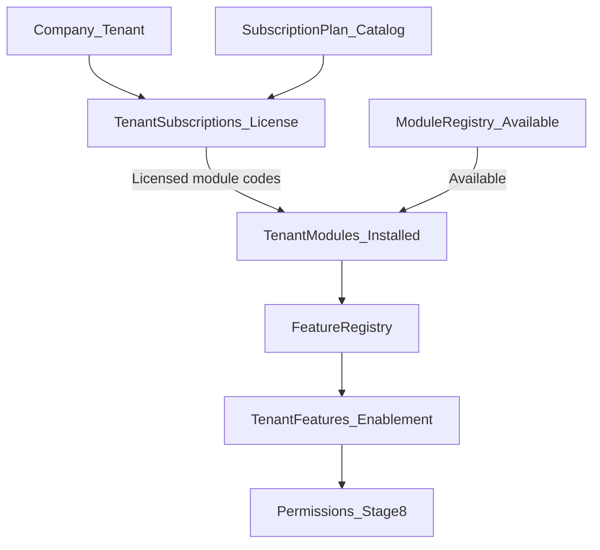

# Platform Administration Foundation

Living gap analysis for the 15-stage Platform Administration roadmap.

- Stage 1: shell + IA + nav + gates
- Stage 2: Company business model + thin Feature Registry
- Stage 3: Module Registry metadata on existing `Modules` / Module Management
- Stage 4: Subscription & License foundation
- Stage 5: Feature Management foundation
- Stage 6: User Management enhancement (this stage)

## Role visibility

| Capability | Super Admin (`SUPER_ADMIN`) | Tenant Admin (`TENANT_ADMIN`) |
|------------|----------------------------|--------------------------------|
| Platform hub `/platform` | Yes (default home) | Yes if any platform permission |
| Companies (cross-tenant; permission `Platform.Tenants.*`) | Yes | No (`Platform.Tenants.*` excluded from template) |
| Organization (hierarchy / branches / departments) | Yes | Own tenant |
| Access Control hub + Users | Yes | Own tenant |
| Modules / Features / Subscriptions | Yes | View/manage own tenant via existing hubs |
| Migrations | Yes (`Platform.Migrations.*`) | No |
| Database Reset / System Maintenance | Yes + Dev/Staging only (`Platform.System.Reset`) | No |
| Settings / Audit Logs | Yes | Own tenant (existing permissions) |

## Canonical route map (reuse, do not rebuild)

| Section | Canonical route | Existing surface |
|---------|-----------------|------------------|
| Hub | `/platform` | `platform-hub` |
| Company | `/platform/tenants` (alias `/platform/companies`) | `tenant-list` / provision / detail — UI says **Companies** |
| Organization | `/platform/organization-designer` | hierarchy feature |
| Branches / Departments | `/platform/branches`, `/platform/departments` | existing CRUD lists |
| Identity | `/platform/access-control` | Users / Roles / Permissions / Policies / Templates tabs |
| Users (standalone) | `/users` | users module — org assignment + profile metadata (Stage 6) |
| Modules | `/platform/module-management` | Module Registry UI (reuse; no new CRUD) |
| Features | `/platform/feature-management` | Feature Management (enable/disable only) |
| Subscriptions | `/platform/subscription-management` | license panels + existing billing |
| Migrations | `/platform/migrations` | existing |
| System Maintenance | `/platform/maintenance` | database reset (label clarified) |
| Settings | `/settings` | settings module |
| Audit | `/audit-logs` | audit-logs module |

### Stage 1 redirects / duplicates

| Legacy entry | Action |
|--------------|--------|
| `/platform` → `branches` | Replaced by hub |
| `/platform/roles` | Redirect → `/platform/access-control?tab=roles` |
| Local `organization-designer` component (unwired) | Leave unused; hierarchy feature is canonical |
| Nav label “Maintenance” under Platform | Renamed to **Database Reset** / System Maintenance |

### Stage 2 aliases

| Entry | Action |
|-------|--------|
| `/platform/companies` | Redirect → `/platform/tenants` |
| Company UI copy | Tenants → Companies (routes + `Platform.Tenants.*` codes unchanged) |
| `GET /api/platform/company/context` | Read-only company context (branding, branch/dept, modules, features, subscription) |
| Feature Registry | `FeatureDefinitions` + `TenantFeatures` metadata |

### Stage 3 Module Registry

| Entry | Action |
|-------|--------|
| `Modules` table | Metadata columns (category, version, status, capability flags, deps, …) |
| Catalog seed | Active enableable codes + Coming Soon / Beta product modules |
| `GET /api/platform/modules` | Enableable definitions (enriched) |
| `GET /api/platform/modules/catalog` | Full registry catalog |
| `GET /api/platform/modules/company` | Company installed + licensed (plan-allowed) |
| `GET /api/platform/modules/{codeOrId}` | Single registry entry |
| Module Management UI | Metadata display + filters; toggles only for Active enableable |
| Mobile | Company context `modules[]` parsed; read-only chips on profile / more |

### Stage 4 Subscription & License

| Entry | Action |
|-------|--------|
| `SubscriptionPlans` catalog | Starter / Pro / Enterprise seed; default module codes + quotas |
| `TenantSubscriptions` | Additive license fields (`SubscriptionCode`, storage, AI credits, GPS) |
| `GET /api/platform/subscriptions` (+ `/catalog`, `/company`) | Plan catalog + current company license |
| `GET /api/platform/license` (+ `/summary`) | Company license / compact summary |
| Semantics | **Available** = Module Registry Visible; **Installed** = `TenantModules`; **Licensed** = plan defaults |
| ERP | Subscription Management license/limits panels; company detail read-only strip |
| Mobile | Company context `subscription`; plan/expiry/modules/limits on profile / more |
| Explicit non-goals | Billing rebuild, gateways, runtime quota enforcement, feature flags |

### Stage 5 Feature Management

| Entry | Action |
|-------|--------|
| `FeatureDefinitions` | Extended metadata (category, status, icon, route, Mobile/AI/GPS, Visible) |
| `TenantFeatures` | Enablement + audit (`EnabledBy`, `EnabledDate`, `LastModified`); keep `IsEnabled` |
| `GET /api/platform/features` (+ `/catalog`, `/company`, `/{key}`) | Registry reads |
| `PUT /api/platform/features/company` | Enable/disable only (no CRUD) |
| Semantics | Features live under Modules; company toggles Active/Beta under installed modules |
| ERP | Feature Management page; company detail grouped read-only summary |
| Mobile | Enabled feature categories on profile / more |
| Consumes | Modules + Subscriptions / License |
| Produces | Company feature configuration |
| Feeds | Permissions, Menus, Workspaces, Dashboards (later stages) |
| Explicit non-goals | Runtime flags, A/B, canary, percentages, builders |

## Stage matrix (1–15)

| # | Stage | Status | Notes |
|---|-------|--------|-------|
| 1 | Platform Administration Foundation | **Done** | Hub, nav sync, ops permissions, child gates, gap doc |
| 2 | Company Business Model | **Done** | Company vocabulary; Feature Registry; mobile context |
| 3 | Module Registry | **Done** | Metadata on `Modules`; catalog/company APIs; Module Management enrichment; mobile module list |
| 4 | Subscription & License | **Done (foundation)** | Plan catalog + license APIs; soft Licensed semantics; consumes Module Registry; hard enforcement deferred |
| 5 | Feature Management | **Done (foundation)** | Extends Feature Registry; company enablement; no runtime flags / builders |
| 6 | User Management | **Done (foundation)** | Org-aware Users; Branch/Department; lifecycle Status; workspace defaults metadata |
| 7 | Role Management | Existing | Access Control Roles tab — Stage 7 enhances business roles / templates |
| 8 | Permission Management | Existing | Access Control Permissions tab; future Permission Engine |
| 9 | Menu Builder | Partial | Schema + `menus/me`; no CRUD builder UI |
| 10 | Workspace Builder | Missing | |
| 11 | Dashboard Builder | Missing | Fixed dashboards only |
| 12 | Data Scope Engine | Missing | Tenant isolation only today |
| 13 | Security Center | Partial | Access Policies tab + settings flags |
| 14 | Audit Center | Partial | View/filter audit logs |
| 15 | Backend Permission Enforcement | Partial | Strong on platform/fleet; gaps on bookings/payments/etc. |

## Foundation permissions (Stage 1)

| Code | Purpose |
|------|---------|
| `Platform.Migrations.View` | View schema migration status |
| `Platform.Migrations.Manage` | Apply pending migrations |
| `Platform.System.Reset` | Database reset (still Super Admin + Dev/Staging) |

## Stage 2 deliverables

- **Persistence:** `Tenants` / `TenantId` unchanged; Company is product/API alias language (`companyId` / `companyName`).
- **Feature Registry:** Seeded catalog + per-company enablement rows; list endpoints (`/api/platform/features/*`).
- **ERP:** Companies copy in hub/list/menus; company detail Hierarchy/Capabilities strip + feature metadata list.
- **Mobile:** Read-only company context after login (profile / more / dashboard header). No company admin CRUD on Flutter.

## Stage 3 deliverables

- **Module Registry:** Metadata on existing `Modules` (no duplicate tables). Status: Active / Beta / Coming Soon / Deprecated / Disabled.
- **APIs:** Catalog, company, by-key read models; existing enable/disable PUT unchanged.
- **ERP:** Module Management shows category, version, dependencies, status, Mobile/AI/GPS, Installed/Licensed.
- **Mobile:** Parses installed `modules[]`; display-only chips. No module admin.

## Stage 4 deliverables

- **Plan catalog:** `SubscriptionPlans` + `SubscriptionPlanCatalog` seed (Starter / Pro / Enterprise).
- **License metadata:** Additive columns on `TenantSubscriptions`; Licensed modules derived from plan defaults ∩ Available Active modules.
- **APIs:** Subscription catalog/company + license/summary; enriched subscription overview; company context nested `subscription`.
- **ERP:** License/limits on Subscription Management; read-only subscription strip on company detail.
- **Mobile:** Parse subscription from company context; display plan, expiry, licensed modules, storage/AI on profile / more.

## Stage 5 deliverables

- **Feature Registry upgrade:** Metadata on existing `FeatureDefinitions` (no duplicate tables). Categories: Fleet, Vehicles, Drivers, Maintenance, Fuel, GPS, Travel, Bookings, Trips, CRM, Finance, Reports, Administration, AI, …
- **Company enablement:** `TenantFeatures` with audit columns; `PUT /api/platform/features/company` enable/disable only.
- **APIs:** Catalog / company / by-key; company context returns enabled features with display metadata.
- **ERP:** Feature Management page (Commercial hub); company detail grouped ✓/✗ summary with deep-link.
- **Mobile:** Parse enriched features; enabled category chips on profile / more. No feature admin.
- **Still missing (later):** Runtime flags / A/B; Permission Engine (Stage 8); Menu / Workspace / Dashboard builders.

## Stage 6 deliverables

- **Users table:** Additive profile/lifecycle/workspace columns (`JobTitle`, `EmployeeCode`, `EmployeeType`, `Status`, workspace/dashboard keys, language/theme/avatar). `IsActive` remains the auth gate; `Status` syncs with it.
- **APIs:** Enriched `/api/Users` list/detail/create/update; filters for branch/department/status/employee type; `GET me` / `profile` / `company/summary`; self-service profile preferences.
- **Company context:** Nested `currentUser` (job title, workspace, theme, language, …); prefer stored workspace key over derived hint.
- **ERP:** Users list columns/filters; form org + metadata fields; Access Control Users tab Branch/Department/Status; company detail user summary strip.
- **Mobile:** Read-only Company / Branch / Department / Job Title / Workspace / Theme. No user admin.
- **Consumes:** Company, Modules, Features. **Produces:** Organization-aware users. **Feeds:** Role Management (Stage 7), Permission Engine (Stage 8).

## Deferred (explicit non-goals of Stages 1–6)

- Renaming `Tenants` table or `TenantId` columns
- Duplicate Module / Feature / User CRUD or Identity replacement
- Runtime feature flags, A/B testing, canary, rollout percentages
- Runtime subscription / quota enforcement
- Billing rebuild, payment gateways, marketplace, self-service purchasing
- Role Management enhancement (Stage 7), Permission Engine (Stage 8)
- Menu/Workspace/Dashboard builders
- Auth / JWT / MFA / password policy redesign
- Mobile Company / Branch / Department / Module / Feature / User admin CRUD
- Employee onboarding workflows / HR module
- Data Scope Engine (Stage 12)

## Handoff to Stage 7

Stage 7 enhances existing **Role Management** with business roles, role templates, company-aware role assignment, and organizational role scoping — reusing ASP.NET-style role codes and Access Control without replacing the identity model or introducing a new RBAC system. Organization-aware Users from Stage 6 are the assignment targets.
