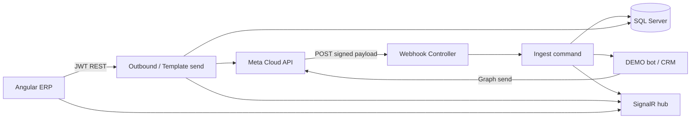

# WhatsApp Architecture (SheikhGo)

Multi-number WhatsApp Cloud API inbox for UAE (Sales/GCC) and Pakistan (Support). Related umbrella notes: [Backend/docs/WHATSAPP_CLOUD_API.md](../../Backend/docs/WHATSAPP_CLOUD_API.md).

## High-level flow

## Domain model

| Entity | Role |
|--------|------|
| `WhatsAppAccounts` | Tenant-scoped UAE/PK business numbers (code, phone, PhoneNumberId) |
| `WhatsAppConversations` | One thread per account + customer phone; assignment, bot, lead/customer link, last in/out times |
| `WhatsAppMessages` | Inbound/outbound rows; Meta `MessageId` unique when present |
| `WhatsAppTemplates` | Local catalog (Draft→Approved…); never auto-approved |

Credentials (`AccessToken`, App Secret, verify token) live in **env / user-secrets only**, merged at runtime by `WhatsAppAccountConfig`. DTOs expose `HasAccessToken` boolean — never the secret.

## Permissions

| Permission | Use |
|------------|-----|
| `WhatsApp.View` | List accounts/conversations/messages/templates; mark read; media proxy |
| `WhatsApp.Reply` | Send text/template; assign; status; bot toggle |
| `WhatsApp.Manage` | CRM link / broader admin |
| `WhatsApp.ManageAccounts` | Activate account; health check |
| `WhatsApp.ManageTemplates` | Upsert / set template status |

There is **no** `WhatsApp.Send` — reply uses `WhatsApp.Reply`.

## Messaging window (Meta CS rule)

Free-form text is allowed for **24 hours** after `LastIncomingMessageAt`. Outside that window, outbound must use an **Approved** local catalog template (`SendWhatsAppTemplateCommand`). Helper: `WhatsAppMessagingWindow` (`WindowSeconds = 86400`).

## Webhook path

1. `GET /api/whatsapp/webhook` — Meta verify challenge (`WhatsAppWebhookVerifier`); verify token never logged.
2. `POST` — HMAC-SHA256 `X-Hub-Signature-256` (`WhatsAppWebhookSignature`); empty `AppSecret` → **fail closed**.
3. Valid signature → `IngestWhatsAppWebhookCommand` (parse, status updates, inbound upsert, idempotency, SignalR).
4. Always `200 OK` after valid signature (avoid Meta retry storms on business errors).
5. Rate limit policy: `public`.

**Latency risk:** ingest currently runs CRM link + DEMO bot + Graph API send **on the request thread** before ACK returns. Fine for low volume; under load this can approach Meta’s webhook timeout. Queue offload is a future hardening (not implemented).

## Idempotency

- Handler skips when `MessageExistsAsync(metaMessageId)`.
- Upsert re-checks `MessageId` inside a transaction.
- Unique filtered index `IX_WhatsAppMessages_MessageId`.

## Tenant isolation

Authenticated inbox APIs take `tenantId` from `ITenantContext` and filter SQL with `TenantId = @TenantId`. SignalR clients join `whatsapp:tenant_{id}`. Webhook resolve-by-`phone_number_id` is cross-tenant by Meta design, then events publish to the conversation’s tenant.

## Indexes (foundation)

- Accounts: `(TenantId, Code)` unique; `PhoneNumberId`; default flag
- Conversations: `(TenantId, AccountId, CustomerPhoneNumber)` unique; `(TenantId, AccountId, LastMessageAt DESC)`; Customer/Lead
- Messages: `MessageId` unique; `(ConversationId, CreatedAt)`; `(TenantId, AccountId, CreatedAt)`
- Templates: unique `(TenantId, WhatsAppAccountId, Name, Language)`

## Performance notes

| Area | Finding |
|------|---------|
| Conversation list | Correlated `TOP 1` last-message preview subquery per row — hotspot as inbox grows |
| Search | `LIKE %…%` on phone/name — not index-friendly |
| Filters | Unread / bot / status lack dedicated indexes |
| Messages | Paginated `OFFSET/FETCH`, pageSize clamped 1–100 |
| SignalR | Tenant-wide broadcast only (no per-conversation groups) |
| Webhook | Sync ingest + bot + Graph (see above) |

## Realtime

- Hub: `/hubs/whatsapp` (`WhatsAppHub`), JWT authorized
- Event: `ReceiveWhatsAppEvent`
- Publisher scopes by tenant group

## ERP surfaces

- `/whatsapp` — inbox (bot/agent badge, window chip, template send, mark read)
- `/whatsapp/accounts` — account admin (`ManageAccounts`)
- `/whatsapp/templates` — catalog status (`ManageTemplates`)
