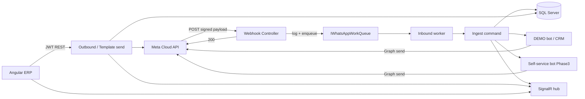

# WhatsApp Architecture (SheikhGo)

Multi-number WhatsApp Cloud API inbox for UAE (Sales/GCC) and Pakistan (Support). Related umbrella notes: [Backend/docs/WHATSAPP_CLOUD_API.md](../../Backend/docs/WHATSAPP_CLOUD_API.md).

## High-level flow

Phase details: [PHASE2.md](./PHASE2.md) (trip automations / tracking), [PHASE3.md](./PHASE3.md) (self-service menu, booking FSM, invoice pay links), [PHASE4.md](./PHASE4.md) (AI Agent Assist; later RAG/campaigns/analytics).

## Domain model

| Entity | Role |
|--------|------|
| `WhatsAppAccounts` | Tenant-scoped UAE/PK business numbers (code, phone, PhoneNumberId) |
| `WhatsAppConversations` | One thread per account + customer phone; assignment, bot, lead/customer link, `WindowExpiresAt` |
| `WhatsAppMessages` | Inbound/outbound rows; Meta `MessageId` unique when present; `AttemptCount` for retry |
| `WhatsAppTemplates` | Local catalog (synced from Meta or manual); never auto-approved |
| `WhatsAppWebhookLogs` | Full payload ops log + processing status (30d retention) |

Credentials (`AccessToken`, App Secret, verify token) live in **env / user-secrets only**, merged at runtime by `WhatsAppAccountConfig`. DTOs expose `HasAccessToken` boolean — never the secret.

## Permissions

| Permission | Use |
|------------|-----|
| `WhatsApp.View` | List accounts/conversations/messages/templates; mark read; media proxy |
| `WhatsApp.Reply` | Send text/template; assign; status; bot toggle |
| `WhatsApp.Manage` | CRM link / broader admin |
| `WhatsApp.ManageAccounts` | Activate account; health check |
| `WhatsApp.ManageTemplates` | Upsert / set template status |

There is **no** `WhatsApp.Send` — reply uses `WhatsApp.Reply`.

## Messaging window (Meta CS rule)

Free-form text is allowed for **24 hours** after the last inbound. `WindowExpiresAt` is persisted on `WhatsAppConversations` (set on each inbound). Helper: `WhatsAppMessagingWindow` (`WindowSeconds = 86400`).

Outside the window, free-text send returns **HTTP 409** with `code: WINDOW_CLOSED` (not a soft `200` fail). Agents must use an **Approved** template (`SendWhatsAppTemplateCommand`).

## Webhook path (async ingest)

1. `GET /api/whatsapp/webhook` — Meta verify challenge (`WhatsAppWebhookVerifier`); verify token never logged.
2. `POST` — HMAC-SHA256 `X-Hub-Signature-256` (`WhatsAppWebhookSignature`); empty `AppSecret` → **fail closed**.
3. Invalid signature → insert `WhatsAppWebhookLogs` (`Rejected`) → **401** (never enqueue).
4. Valid signature → insert webhook log → `IWhatsAppWorkQueue.EnqueueInbound` → **200 OK** immediately.
5. `WhatsAppInboundWorkerHostedService` dequeues → `IngestWhatsAppWebhookCommand` → mark log Succeeded / Failed (SQL DLQ after N attempts).
6. Rate limit policy: `public`.

Queue abstraction: `IWhatsAppWorkQueue` with in-process `ChannelWhatsAppWorkQueue` today; RabbitMQ adapter can replace without rewriting handlers.

Admin: `GET /api/whatsapp/webhook-logs`, `POST /api/whatsapp/webhook-logs/{id}/requeue` (`WhatsApp.Manage`). Retention purge: 30 days for webhook logs.

## Delivery status + retry

- Forward-only ranks: Queued → Sent → Delivered → Read; Failed is terminal for that attempt (`WhatsAppMessageStatusPrecedence`).
- `POST /api/whatsapp/messages/{id}/retry` (`WhatsApp.Reply`) — max 3 attempts (`AttemptCount`).

## Templates + context

- Meta sync: `POST /api/whatsapp/accounts/{id}/templates/sync` (`WhatsApp.ManageTemplates`) upserts by `(AccountId, Name, Language)`.
- Context: `GET /api/whatsapp/conversations/{id}/context` — customer/company, bookings, last trip, unpaid total.
- Create lead (agent intent): `POST /api/whatsapp/conversations/{id}/create-lead`.

## Idempotency

- Handler skips when `MessageExistsAsync(metaMessageId)`.
- Upsert re-checks `MessageId` inside a transaction.
- Unique filtered index `IX_WhatsAppMessages_MessageId`.

## Tenant isolation

Authenticated inbox APIs take `tenantId` from `ITenantContext` and filter SQL with `TenantId = @TenantId`. SignalR clients join `whatsapp:tenant_{id}`. Webhook resolve-by-`phone_number_id` is cross-tenant by Meta design, then events publish to the conversation’s tenant.

## Indexes (foundation)

- Accounts: `(TenantId, Code)` unique; `PhoneNumberId`; default flag
- Conversations: `(TenantId, AccountId, CustomerPhoneNumber)` unique; `(TenantId, AccountId, LastMessageAt DESC)`; Customer/Lead
- Messages: `MessageId` unique; `(ConversationId, CreatedAt)`; `(TenantId, AccountId, CreatedAt)`
- Templates: unique `(TenantId, WhatsAppAccountId, Name, Language)`
- Webhook logs: `ReceivedAtUtc`, `(ProcessingStatus, ReceivedAtUtc)`

## Performance notes

| Area | Finding |
|------|---------|
| Conversation list | Correlated `TOP 1` last-message preview subquery per row — hotspot as inbox grows |
| Search | `LIKE %…%` on phone/name — not index-friendly |
| Filters | Unread / bot / status lack dedicated indexes |
| Messages | Paginated `OFFSET/FETCH`, pageSize clamped 1–100 |
| SignalR | Tenant-wide broadcast only (no per-conversation groups) |
| Webhook | Fast ACK via Channel queue (worker processes ingest async) |

## Realtime

- Hub: `/hubs/whatsapp` (`WhatsAppHub`), JWT authorized
- Event: `ReceiveWhatsAppEvent`
- Publisher scopes by tenant group

## ERP surfaces

- `/whatsapp` — inbox (window countdown, ticks/retry, template variables, context panel)
- `/whatsapp/accounts` — account admin (`ManageAccounts`)
- `/whatsapp/templates` — catalog + Meta sync (`ManageTemplates`)
- `/whatsapp/webhook-logs` — webhook ops (`Manage`)
